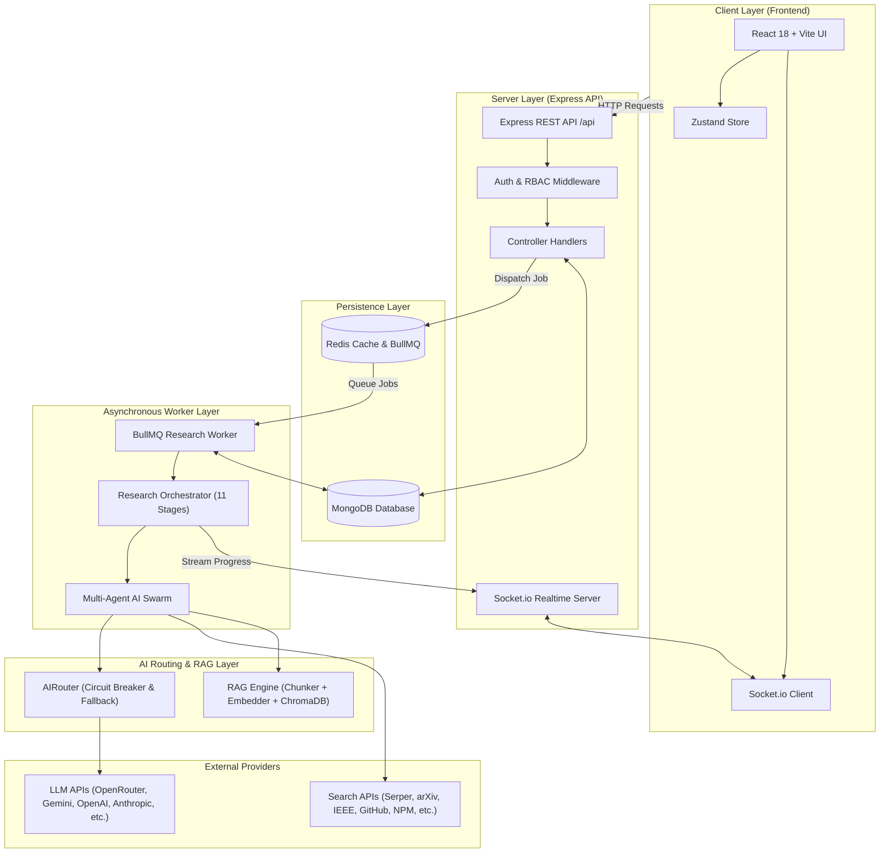
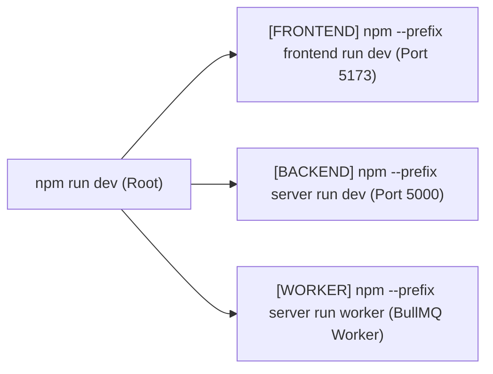
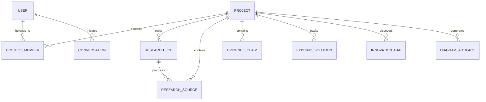

<div align="center">

# ⚡ NEXUS
### Autonomous AI Research Copilot & Strategic Technology Engine

[](LICENSE)
[](https://nodejs.org/)
[](https://react.dev/)
[](https://www.typescriptlang.org/)
[](https://expressjs.com/)
[](https://www.mongodb.com/)
[](https://redis.io/)
[](https://docs.bullmq.io/)
[](https://tailwindcss.com/)

**NEXUS** is an enterprise-grade, multi-agent AI research platform designed to automate deep technological research, academic paper aggregation, web evidence mining, market gap discovery, adversarial stress-testing, and system architecture design.

[Key Features](#2-key-features) • [System Architecture](#3-system-architecture) • [Tech Stack](#5-tech-stack) • [Installation Guide](#7-installation-guide) • [AI Pipeline](#10-ai-pipeline) • [API Documentation](#11-api-overview)

---

</div>

## 📋 Table of Contents

- [1. Project Introduction](#1-project-introduction)
- [2. Key Features](#2-key-features)
- [3. System Architecture](#3-system-architecture)
- [4. Folder Structure](#4-folder-structure)
- [5. Tech Stack](#5-tech-stack)
- [6. Prerequisites](#6-prerequisites)
- [7. Installation Guide](#7-installation-guide)
- [8. Environment Variables](#8-environment-variables)
- [9. Running the Project](#9-running-the-project)
- [10. AI Pipeline](#10-ai-pipeline)
- [11. API Overview](#11-api-overview)
- [12. Database Schema](#12-database-schema)
- [13. Queue System](#13-queue-system)
- [14. AI & Search Providers](#14-ai--search-providers)
- [15. Application Screenshots](#15-application-screenshots)
- [16. Performance & Optimizations](#16-performance--optimizations)
- [17. Security Architecture](#17-security-architecture)
- [18. Development Workflow](#18-development-workflow)
- [19. Contributing Guide](#19-contributing-guide)
- [20. Future Roadmap](#20-future-roadmap)
- [21. License](#21-license)
- [22. Author](#22-author)
- [23. Acknowledgements](#23-acknowledgements)

---

## 1. Project Introduction

### What is NEXUS?
**NEXUS** is an autonomous, multi-agent AI research copilot and strategic decision engine. It replaces manual web searches, academic paper reviews, and architectural planning with an automated, 11-stage research orchestrator.

### What Problem Does It Solve?
Building modern, state-of-the-art software applications requires extensive pre-implementation research:
1. **Scattered Evidence**: Finding relevant papers, repositories, web discussions, and package ecosystems requires searching multiple disparate platforms.
2. **Analysis Paralysis**: Evaluating existing market solutions and pinpointing technical innovation gaps is time-consuming.
3. **Unvalidated Assumptions**: System designs often fail due to unverified edge cases or lack of adversarial stress-testing.

NEXUS automates this end-to-end workflow by dispatching autonomous AI agents to query multi-source search providers, score source credibility, discover market gaps, stress-test ideas against real-world constraints, design software architecture diagrams, and build actionable execution roadmaps.

### Why Was It Built?
NEXUS was created to bridge the gap between initial software ideation and production-ready technical specification. By leveraging multi-agent AI collaboration and robust fallback routing across major LLM providers, NEXUS ensures every research insight is backed by verified multi-source evidence.

### Who Is It For?
- **Software Engineers & Architects**: Designing microservices, choosing tech stacks, and verifying trade-offs.
- **Product Managers & Strategists**: Conducting competitive analysis and market gap discovery.
- **R&D Teams & Founders**: Accelerating feasibility studies and technical proof-of-concepts.
- **Academic & Industry Researchers**: Aggregating literature from arXiv, IEEE Xplore, and Semantic Scholar.

---

## 2. Key Features

- 🤖 **Multi-Agent Swarm**: 11 specialized AI agents working together (Problem Understanding, Query Planner, Deep Search, Analysis, Gap Finder, Critic, Architect, Roadmap, Security, Cost, Performance).
- 🔍 **Multi-Provider Search Integration**: Unified search across **Serper (Google Web)**, **arXiv**, **Semantic Scholar**, **IEEE Xplore**, **GitHub Repositories**, **NPM Packages**, and **Stack Overflow**.
- 🔀 **Resilient AI Router (`AIRouter`)**: Automatic fallback management across **7 AI Providers** (OpenRouter, Gemini, OpenAI, Anthropic, Groq, DeepSeek, Together) with circuit breaking and exponential backoff.
- ⚡ **Background Queue Workers**: Dedicated Redis + BullMQ process (`research.worker.ts`) executing long-running jobs asynchronously with retry policies.
- 📡 **Real-Time WebSocket Streaming**: Socket.io live log stream, stage progress, and alert notifications pushed directly to the UI.
- 🧠 **RAG Retrieval Engine**: Built-in chunking, text embedding, and ChromaDB vector store support (with in-memory fallback) for contextual evidence retrieval.
- 💬 **Interactive AI Copilot**: Project-aware copilot assistant (`copilot.agent.ts`) with access to live research job states and vector index context.
- 📊 **Architecture & Diagram Generation**: Auto-generates system architecture specifications and Mermaid.js sequence/architecture diagrams.
- 🔐 **Enterprise Auth & RBAC**: Dual JWT authentication (Access & Refresh tokens), password hashing with `bcryptjs`, and role-based access control (`owner`, `editor`, `viewer`).
- 📁 **Export Capabilities**: Export comprehensive research reports to Markdown, JSON, PDF, or rendered Kroki SVG diagrams.

---

## 3. System Architecture

NEXUS uses a decoupled client-server architecture powered by an asynchronous queue worker and real-time Socket.io communication.



### Component Breakdown

| Component | Responsibility |
| :--- | :--- |
| **Frontend App** | Single Page Application built with React 18, Vite, TailwindCSS, and Radix UI components. |
| **Express API** | Handles REST requests, authentication, rate limiting, and project permissions. |
| **BullMQ Worker** | Standalone Node.js process consuming queue jobs and managing long-running agent pipelines. |
| **Research Orchestrator** | Coordinates execution of the 11 research stages, saving checkpoints to MongoDB. |
| **AIRouter** | Manages provider health, circuit breaker state, model fallbacks, and usage metrics. |
| **RAG Pipeline** | Processes scraped sources, generates vector embeddings, and performs top-K semantic search. |
| **Socket.io Server** | Pushes real-time progress, stage state mutations, and copilot streams to connected clients. |

---

## 4. Folder Structure

```
nexus/
├── package.json                   # Root package runner (starts Frontend, Backend, Worker)
├── README.md                      # Project documentation
│
├── frontend/                      # Client Single Page Application
│   ├── package.json
│   ├── vite.config.ts
│   ├── tailwind.config.js
│   └── src/
│       ├── components/            # UI components (Copilot, Pipeline, Diagram, Export, Shared)
│       ├── features/              # Feature modules (Auth, Projects, Research)
│       ├── hooks/                 # Custom React hooks (useAuth, useSocket, etc.)
│       ├── layouts/               # Page layout containers (DashboardLayout, AuthLayout)
│       ├── pages/                 # Top-level view routes (Dashboard, Project, Discoveries, etc.)
│       ├── stores/                # Global Zustand state stores
│       └── types/                 # Shared TypeScript interface definitions
│
└── server/                        # Node.js Express & Worker Backend
    ├── package.json
    ├── .env.example               # Template environment configuration
    └── src/
        ├── agents/                # AI Agent definitions (DeepSearch, Architect, Critic, etc.)
        ├── circuit-breaker/       # Circuit breaker registry & fault tolerance
        ├── controllers/           # REST API request handlers
        ├── core/                  # System core (Config, Logger, Database, Redis)
        ├── export/                # Report export utilities (PDF, Markdown, JSON)
        ├── integrations/          # AIRouter & AI provider adapters (Gemini, OpenAI, OpenRouter, etc.)
        ├── middleware/            # Auth, Rate Limiting, RBAC, Backpressure middleware
        ├── models/                # Mongoose Database Schemas (Project, ResearchJob, User, etc.)
        ├── observability/         # Prometheus metrics & logger stream
        ├── orchestrator/          # ResearchOrchestrator pipeline coordinator
        ├── rag/                   # Chunker, Embedder, Retriever & ChromaDB integration
        ├── research/              # Search Provider Registry (Serper, arXiv, IEEE, GitHub, etc.)
        ├── routes/                # Express API Route definitions
        ├── schemas/               # Zod validation schemas
        ├── socket/                # Socket.io connection handlers & event emitters
        ├── workers/               # BullMQ background workers (research.worker.ts)
        ├── app.ts                 # Express application initialization
        └── server.ts              # HTTP & Socket.io server entry point
```

---

## 5. Tech Stack

| Category | Technology | Description |
| :--- | :--- | :--- |
| **Frontend Framework** | React 18 | Declarative UI library with functional components and hooks. |
| **Build Tool** | Vite | Next-generation fast frontend bundler and HMR dev server. |
| **Styling** | TailwindCSS | Utility-first CSS framework for custom responsive styling. |
| **State Management** | Zustand | Lightweight, unopinionated client state management. |
| **Backend Runtime** | Node.js (v18+) | Server-side JavaScript runtime engine. |
| **Web Server** | Express | Fast, unopinionated Web Framework for HTTP endpoints. |
| **Database** | MongoDB & Mongoose | Document object database and schema modeling layer. |
| **Task Queue** | Redis & BullMQ | In-memory data store powering asynchronous background jobs. |
| **Real-time Server** | Socket.io | Bidirectional WebSocket event-based communication. |
| **AI Router** | AIRouter (Custom) | Fault-tolerant multi-LLM router with circuit breaking. |
| **Vector DB** | ChromaDB / Memory Store | High-performance vector database for semantic RAG search. |
| **Validation** | Zod | TypeScript-first schema declaration and validation. |
| **Language** | TypeScript | Static type safety across both frontend and backend. |

---

## 6. Prerequisites

Before installing NEXUS, ensure your environment meets the following requirements:

- **Node.js**: `v18.0.0` or higher (recommended: `v20.x`)
- **npm**: `v9.0.0` or higher
- **MongoDB**: Local instance running on port `27017` OR a MongoDB Atlas connection string.
- **Redis**: Local instance running on port `6379` (or custom port).
- **API Keys** *(At least one required for AI operations)*:
  - **OpenRouter API Key** (Recommended gateway) OR **Gemini API Key** / **OpenAI API Key**
  - **Serper API Key** *(Optional, for Google Web search capability)*
  - **GitHub Token** *(Optional, for repository code search)*

---

## 7. Installation Guide

Follow these steps to clone and set up the NEXUS platform:

### 1. Clone the Repository
```bash
git clone https://github.com/your-org/nexus.git
cd nexus
```

### 2. Install Root & Sub-Workspace Dependencies
Execute `npm install` at the root project directory. This installs `concurrently` at the root and downloads required workspace dependencies:
```bash
# Install root dependencies
npm install

# Install server dependencies
npm --prefix server install --legacy-peer-deps

# Install frontend dependencies
npm --prefix frontend install
```

### 3. Configure Environment Variables
Copy `.env.example` in the `server` directory to `.env`:
```bash
cp server/.env.example server/.env
```
Edit `server/.env` and insert your MongoDB URI, Redis credentials, JWT secrets, and AI provider API keys.

---

## 8. Environment Variables

The backend requires key environment variables configured in `server/.env`. Below is a breakdown of the configuration keys:

| Variable | Description | Required? | Default / Example Value |
| :--- | :--- | :---: | :--- |
| `NODE_ENV` | Application runtime environment. | Yes | `development` |
| `PORT` | HTTP port for backend Express server. | Yes | `5000` |
| `FRONTEND_URL` | CORS allowed client origin. | Yes | `http://localhost:5173` |
| `MONGODB_URI` | Connection URI for MongoDB database. | Yes | `mongodb://localhost:27017/nexus` |
| `REDIS_URL` | Connection URL for Redis server. | Yes | `redis://localhost:6379` |
| `JWT_SECRET` | Primary signing key for Access Tokens. | Yes | `use-a-strong-secret-min-32-chars` |
| `JWT_REFRESH_SECRET` | Signing key for Refresh Tokens. | Yes | `use-a-different-strong-secret` |
| `JWT_EXPIRES_IN` | Validity duration of access tokens. | No | `15m` |
| `JWT_REFRESH_EXPIRES_IN` | Validity duration of refresh tokens. | No | `7d` |
| `DEFAULT_AI_PROVIDER` | Primary LLM provider identifier. | Yes | `openrouter` |
| `OPENROUTER_API_KEY` | OpenRouter API gateway key. | Recommended | `sk-or-v1-...` |
| `GEMINI_API_KEY` | Google Gemini API key. | Optional | `AIzaSy...` |
| `OPENAI_API_KEY` | OpenAI API key. | Optional | `sk-...` |
| `ANTHROPIC_API_KEY` | Anthropic Claude API key. | Optional | `sk-ant-...` |
| `SERPER_API_KEY` | Serper API key for Google Web search. | Optional | `b973...` |
| `GITHUB_TOKEN` | GitHub Personal Access Token for search. | Optional | `ghp_...` |
| `IEEE_XPLORE_API_KEY` | IEEE Xplore API key for academic papers. | Optional | `e9g9...` |
| `VECTOR_STORE` | RAG Vector Store mode (`memory` or `chroma`). | No | `memory` |
| `CHROMA_URL` | ChromaDB vector server endpoint. | Optional | `http://localhost:8000` |

---

## 9. Running the Project

NEXUS includes a unified root workspace script that launches all three micro-services concurrently in a single terminal.

### Single Command Execution

Run the following command from the root directory:

```bash
npm run dev
```

### What Starts Internally?

Executing `npm run dev` spawns three concurrent child processes using `npm --prefix`:



1. 🩵 **`[FRONTEND]`**: Launches Vite dev server at `http://localhost:5173`.
2. 💙 **`[BACKEND]`**: Launches Express REST API & Socket.io server with `tsx watch` at `http://localhost:5000`.
3. 🩷 **`[WORKER]`**: Launches the standalone BullMQ research worker background process.

---

## 10. AI Pipeline

The core of NEXUS is an 11-stage autonomous research pipeline executed by `ResearchOrchestrator`. Each stage performs a specific function and updates the job's progress state:

```
 ┌────────────────┐      ┌────────────────┐      ┌────────────────┐
 │ 1. Understand  │ ───> │   2. Plan      │ ───> │ 3. Search Web  │
 └────────────────┘      └────────────────┘      └────────────────┘
                                                         │
 ┌────────────────┐      ┌────────────────┐              │
 │ 6. Analyze     │ <─── │ 5. GitHub      │ <─── ┌───────┴────────┐
 └────────────────┘      └────────────────┘      │ 4. Papers      │
         │                                       └────────────────┘
         ▼
 ┌────────────────┐      ┌────────────────┐      ┌────────────────┐
 │ 7. Solutions   │ ───> │    8. Gaps     │ ───> │   9. Stress    │
 └────────────────┘      └────────────────┘      └────────────────┘
                                                         │
 ┌────────────────┐                              │
 │  11. Roadmap   │ <─── ┌────────────────┐ <────┘
 └────────────────┘      │10. Architecture│
                         └────────────────┘
```

### Stage Details

1. **`understand`** *(Problem Understanding)*: Extracts domain constraints, core objectives, and technical challenges from the project prompt.
2. **`plan`** *(Query Planning)*: Formulates targeted, boolean search queries tailored for search providers.
3. **`search_web`** *(Web Search)*: Dispatches web queries via Serper API to collect current web articles and technical blogs.
4. **`search_papers`** *(Academic Search)*: Fetches peer-reviewed papers from arXiv, Semantic Scholar, and IEEE Xplore.
5. **`search_github`** *(Repository Search)*: Scrapes repository structures, stars, topics, and package dependency information.
6. **`analyze`** *(Evidence Analysis)*: Synthesizes harvested sources, verifies relevance, and indexes text into the RAG vector store.
7. **`solutions`** *(Solution Mapping)*: Categorizes existing market solutions, listing their pros, cons, and architectural patterns.
8. **`gaps`** *(Innovation Gap Discovery)*: Identifies unaddressed technical gaps, scalability bottlenecks, and market opportunities.
9. **`stress`** *(Adversarial Stress Testing)*: Critic agent subjects proposed solutions to failure mode analysis and security evaluations.
10. **`architecture`** *(Architecture Design)*: Generates comprehensive component design specifications and Mermaid sequence/C4 diagrams.
11. **`roadmap`** *(Roadmap Generation)*: Constructs a milestone-driven execution plan categorized into Phase 1 (MVP), Phase 2 (Scaling), and Phase 3 (Enterprise).

---

## 11. API Overview

NEXUS exposes a structured RESTful API under the `/api` route prefix.

### Authentication Endpoints (`/api/auth`)
| Method | Endpoint | Description | Auth Required |
| :--- | :--- | :--- | :---: |
| `POST` | `/api/auth/register` | Register a new user account | No |
| `POST` | `/api/auth/login` | Authenticate credentials & return JWT tokens | No |
| `POST` | `/api/auth/refresh` | Obtain new access token via refresh token | No |
| `POST` | `/api/auth/logout` | Invalidate active user session | Yes |
| `GET` | `/api/auth/me` | Fetch authenticated user profile | Yes |

### Project Endpoints (`/api/projects`)
| Method | Endpoint | Description | Auth / Role |
| :--- | :--- | :--- | :---: |
| `GET` | `/api/projects` | List all user projects | Viewer |
| `POST` | `/api/projects` | Create a new research project | Authenticated |
| `GET` | `/api/projects/:id` | Get project details & metadata | Viewer |
| `PUT` | `/api/projects/:id` | Update project title or description | Editor |
| `DELETE`| `/api/projects/:id` | Soft-delete project | Owner |
| `POST` | `/api/projects/:id/members` | Invite new team member | Owner |

### Research Pipeline Endpoints (`/api/projects/:projectId/research`)
| Method | Endpoint | Description | Auth / Role |
| :--- | :--- | :--- | :---: |
| `POST` | `/api/projects/:id/research/start` | Queue an 11-stage research job | Editor |
| `GET` | `/api/projects/:id/research/job` | Fetch current research job state | Viewer |
| `GET` | `/api/projects/:id/research/sources` | Retrieve harvested sources | Viewer |
| `GET` | `/api/projects/:id/research/evidence` | Fetch extracted evidence claims | Viewer |
| `GET` | `/api/projects/:id/research/solutions` | Fetch existing solution matrices | Viewer |
| `GET` | `/api/projects/:id/research/gaps` | Fetch identified innovation gaps | Viewer |
| `GET` | `/api/projects/:id/research/architecture` | Fetch generated system architecture | Viewer |
| `GET` | `/api/projects/:id/research/roadmap` | Fetch implementation roadmap | Viewer |
| `POST` | `/api/projects/:id/research/stresstest` | Trigger adversarial stress-test agent | Editor |

### Copilot Endpoints (`/api/projects/:projectId/copilot`)
| Method | Endpoint | Description | Auth / Role |
| :--- | :--- | :--- | :---: |
| `POST` | `/api/projects/:id/copilot/chat` | Send message to project Copilot agent | Viewer |
| `GET` | `/api/projects/:id/copilot/conversations` | List project copilot sessions | Viewer |
| `GET` | `/api/projects/:id/copilot/history` | Fetch message history for session | Viewer |

---

## 12. Database Schema

NEXUS uses Mongoose schemas to persist projects, jobs, evidence, and user data in MongoDB:



### Primary Collections

- **`User`**: User profile credentials, hashed password, role, and avatar settings.
- **`Project`**: Root container storing project title, description, domain, status, and owner reference.
- **`ResearchJob`**: Tracks execution state of an 11-stage pipeline, including stage status, progress %, timings, and errors.
- **`ResearchSource`**: Harvested raw source metadata, title, author, URL, content snippet, and provider origin.
- **`EvidenceClaim`**: Extracted claims verified by analysis agents, mapped with credibility scores.
- **`ExistingSolution`**: Analysis of competitors, software frameworks, and existing market alternatives.
- **`InnovationGap`**: Identified technical limitations, market voids, and opportunity vectors.
- **`DiagramArtifact`**: Rendered Mermaid.js diagram definitions and Kroki URLs.
- **`AIUsageLog`**: Audit record logging token consumption, execution latency, and cost per AI request.

---

## 13. Queue System

Long-running research jobs are executed asynchronously outside the main API thread using **BullMQ** and **Redis**.

```
[REST API: POST /start] ──> Enqueue Job ──> [Redis Queue: 'research']
                                                  │
                                                  ▼
[Worker: research.worker.ts] <── Dequeue Job ─────┘
         │
         ├── Process 11 Stages
         ├── Update MongoDB Checkpoints
         └── Emit Socket.io Events ──> [Connected Frontend Clients]
```

### Queue Characteristics
- **Queue Name**: `research`
- **Worker Concurrency**: Configured via `RESEARCH_WORKER_CONCURRENCY` (Default: `2`).
- **Retry Strategy**: Exponential backoff with `RESEARCH_JOB_ATTEMPTS` retry attempts (Default: `2`).
- **Graceful Shutdown**: Listens for `SIGTERM`/`SIGINT` to allow active in-flight jobs to complete checkpointing before releasing connections.

---

## 14. AI & Search Providers

### Integrated LLM Providers (`AIRouter`)

NEXUS connects to 7 major LLM providers via a unified interface:

1. **OpenRouter**: Primary API gateway supporting unified access to top open and closed models.
2. **Google Gemini**: Direct integration supporting `gemini-1.5-pro` and `gemini-1.5-flash`.
3. **OpenAI**: Native adapter supporting `gpt-4o`, `gpt-4o-mini`, and embeddings models.
4. **Anthropic**: Direct integration for `claude-3-5-sonnet` and `claude-3-haiku`.
5. **Groq**: Ultra-low-latency provider for fast open-source inference (`llama-3`).
6. **DeepSeek**: Adapter supporting `deepseek-chat` (V3) and `deepseek-reasoner` (R1).
7. **Together AI**: Provider for open-weights model inference.

### Integrated Search Providers

1. 🌐 **Serper**: Google Web Search engine API.
2. 📄 **arXiv**: Open-access academic paper repository search.
3. 🔬 **Semantic Scholar**: Scientific paper metadata and citation engine.
4. 📚 **IEEE Xplore**: Engineering literature and IEEE publication search.
5. 🐙 **GitHub**: Repository, codebase structure, and topic search.
6. 📦 **NPM Registry**: Node.js ecosystem package metadata lookup.
7. 💬 **Stack Overflow**: Community technical Q&A search.

---

## 15. Application Screenshots

 

<details>
<summary>📸 View Application UI Placeholders</summary>

### 1. Dashboard View


### 2. Live Research Pipeline


### 3. Architecture & Diagram Viewer


### 4. Interactive Copilot


</details>

---

## 16. Performance & Optimizations

- 🚀 **Asynchronous Worker Execution**: Offloads heavy web scraping and LLM synthesis to background workers, keeping the API responsive.
- ⚡ **Multi-Provider Fallback**: `AIRouter` dynamically routes past rate-limited or degraded LLM APIs without failing jobs.
- 🧹 **Source Deduplication**: `deduplicator.ts` removes duplicate search results across providers based on normalized URL hashing.
- 🧠 **Vector RAG Caching**: Chunks and caches indexed source embeddings to reduce redundant LLM context window consumption.
- 📡 **WebSockets vs Polling**: Pushes real-time updates via Socket.io channels instead of requiring clients to perform expensive HTTP polling.

---

## 17. Security Architecture

- **Token Security**: Short-lived JWT Access Tokens (15 mins) paired with HTTP-only Refresh Tokens (7 days).
- **Password Protection**: Passwords hashed using strong `bcryptjs` salt rounds before DB persistence.
- **Fail-Fast Config Validation**: `validateConfig()` validates presence of JWT secrets and valid port numbers at startup before opening database connections.
- **Rate Limiting**: `express-rate-limit` enforces endpoint-specific request caps on authentication routes and research mutation calls.
- **HTTP Security Headers**: `helmet` middleware configures standard XSS, MIME sniffing, and clickjacking protection headers.
- **Strict Data Validation**: Request payloads are sanitized using `Zod` validation schemas before reaching controllers.

---

## 18. Development Workflow

### Git Branching Model
- `main`: Production-ready release branch.
- `develop`: Integration branch for upcoming feature releases.
- `feature/<feature-name>`: Topic branches for new capabilities.
- `fix/<bug-name>`: Patch branches for issue fixes.

### Commit Conventions
NEXUS uses conventional commit messages:
```text
feat(pipeline): add IEEE search provider integration
fix(redis): prevent reconnect errors when client is active
docs(readme): update environment setup instructions
```

---

## 19. Contributing Guide

We welcome contributions to NEXUS! Please follow these steps to contribute:

1. **Fork the Repository**: Click the "Fork" button on GitHub.
2. **Clone your Fork**:
   ```bash
   git clone https://github.com/your-username/nexus.git
   cd nexus
   ```
3. **Create a Feature Branch**:
   ```bash
   git checkout -b feature/amazing-new-feature
   ```
4. **Commit your Changes**:
   ```bash
   git commit -m "feat(agent): implement new security audit agent"
   ```
5. **Push to Branch**:
   ```bash
   git push origin feature/amazing-new-feature
   ```
6. **Open a Pull Request**: Describe your proposed changes and reference any related open issues.

---

## 20. Future Roadmap

- [ ] **Multi-Tenancy & Teams**: Full organization management with custom workspaces.
- [ ] **Autonomous Web Crawler**: Headless browser agent for interactive web page crawling.
- [ ] **ChromaDB Cloud Cluster**: Native connector for remote managed vector indexes.
- [ ] **Automated PDF Exporter**: High-fidelity PDF report generation with embedded charts.
- [ ] **VS Code / IDE Extension**: Direct integration to view research insights inside the code editor.
- [ ] **Slack & Discord Bots**: Trigger research pipelines via chat commands (`/nexus research "idea"`).

---

## 21. License

Distributed under the **MIT License**. See `LICENSE` for more details.

---

## 22. Author

**NEXUS R&D Team**
- GitHub: [@Abhishekgujar28](https://github.com/Abhishekgujar28)
- Project Repository: [https://github.com/Abhishekgujar28/NEXUS](https://github.com/Abhishekgujar28/NEXUS)

---

## 23. Acknowledgements

Special thanks to the open-source projects and libraries that make NEXUS possible:

- [React](https://react.dev/) & [Vite](https://vitejs.dev/)
- [Express](https://expressjs.com/) & [Node.js](https://nodejs.org/)
- [MongoDB](https://www.mongodb.com/) & [Mongoose](https://mongoosejs.com/)
- [BullMQ](https://docs.bullmq.io/) & [Redis](https://redis.io/)
- [OpenRouter](https://openrouter.ai/) & [Google Gemini](https://ai.google.dev/)
- [TailwindCSS](https://tailwindcss.com/) & [Radix UI](https://www.radix-ui.com/)
- [Mermaid.js](https://mermaid.js.org/) & [Kroki](https://kroki.io/)

---

<div align="center">
  <sub>Built with ❤️ for developers, researchers, and technology pioneers worldwide.</sub>
</div>
