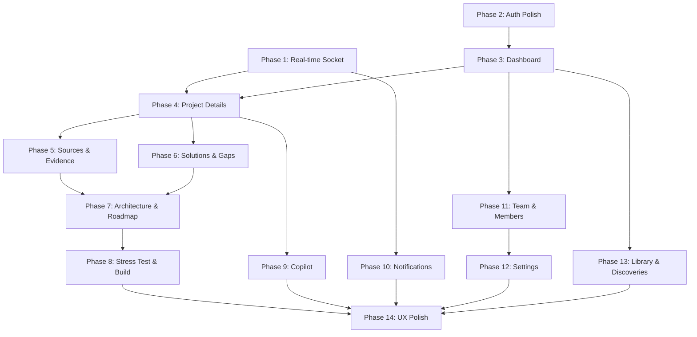

    # NEXUS — Frontend Implementation Plan

> Phase-by-phase plan to fully integrate the frontend with the backend.
> Each phase completes one feature area end-to-end before moving to the next.

---

## Current State Assessment

### What's Already Working ✅
| Area | Status | Notes |
|------|--------|-------|
| **Auth store + API client** | Complete | Zustand, token refresh, interceptors |
| **Service layer** | Complete | All endpoints wrapped in `services.ts` |
| **Socket client** | Complete | Join/leave rooms, lazy singleton |
| **Types** | Complete | All 13 models typed in `types/index.ts` |
| **Design system** | Complete | Tailwind config, HSL tokens, animations |
| **UI primitives** | Complete | 15 Radix-based components in `ui/` |
| **AppLayout + sidebar** | Complete | Projects, pinned, nav, user menu |
| **Auth pages** | Complete | Login + Register forms, functional |
| **Dashboard** | Complete | Project list with cards + status badges |
| **New Project** | Complete | Full form with progressive disclosure |
| **Project Page** | Complete | 12-tab navigation, all tabs render |
| **All 12 Project Tabs** | Complete | All consume real API data via React Query |
| **Copilot** | Complete | Chat with suggested questions |
| **Team Activity** | Complete | Activity feed (inferred from project data) |
| **Settings** | Partial | UI only, no save functionality |
| **Landing Page** | Partial | Viewport-based scroll, needs polish |
| **Command Menu** | Complete | ⌘K search across projects |

### What Needs Improvement 🔧
| Area | Issue | Priority |
|------|-------|----------|
| **Socket.IO integration** | Socket events not wired to React Query invalidation | High |
| **Research real-time** | No live progress updates in ResearchProgressTab | High |
| **Settings save** | No API call on "Save changes" | Medium |
| **Notifications** | No notification system in the frontend | Medium |
| **Discoveries page** | Route exists in sidebar but no page | Medium |
| **Library page** | Route exists in sidebar but no page | Medium |
| **Copilot history** | No history loading on mount | Medium |
| **Project members** | No member management UI | Low |
| **Optimistic updates** | No optimistic mutations anywhere | Low |
| **Infinite scroll** | Sources hardcoded to limit 50, no pagination controls | Low |

---

## Phase 1 — Real-time Research Pipeline

**Goal**: Wire Socket.IO events to make research progress truly real-time.

### Files

| Action | File | What |
|--------|------|------|
| NEW | `src/hooks/useResearchSocket.ts` | Custom hook: joins project room, listens to `research:progress/complete/failed`, invalidates React Query cache |
| MODIFY | `src/features/project/ResearchProgressTab.tsx` | Use `useResearchSocket`, add live stage animations |
| MODIFY | `src/pages/ProjectPage.tsx` | Use `useResearchSocket` to update header progress bar |
| MODIFY | `src/layouts/AppLayout.tsx` | Listen for `research:complete` to trigger sidebar refresh |

### API Endpoints
- Socket: `research:progress`, `research:complete`, `research:failed`
- `GET /research/:id/job` (for fallback polling)

### Hooks
- `useResearchSocket(projectId)` — manages room join/leave lifecycle + event listeners

### States
- Socket connection status
- Live stage transition animation state
- Toast notifications on complete/failed

### Dependencies
- `socket.io-client` (already installed)
- `@tanstack/react-query` (already installed)

### Estimated Effort: 2-3 hours

---

## Phase 2 — Authentication Polish

**Goal**: Ensure auth flow is bulletproof. Add redirect-after-login, password validation feedback.

### Files

| Action | File | What |
|--------|------|------|
| MODIFY | `src/pages/LoginPage.tsx` | Redirect to intended page after login (save redirect URL) |
| MODIFY | `src/pages/RegisterPage.tsx` | Add password strength indicator, match Zod backend validation |
| MODIFY | `src/stores/auth.ts` | Add `redirectAfterLogin` state |
| MODIFY | `src/App.tsx` | Pass redirect URL from `ProtectedRoute` to login |

### API Endpoints
- `POST /auth/login`
- `POST /auth/register`
- `POST /auth/refresh`
- `GET /auth/me`

### States
- `redirectAfterLogin: string | null` in auth store

### Estimated Effort: 1-2 hours

---

## Phase 3 — Dashboard Enhancement

**Goal**: Make dashboard a true home. Add active research count, recently updated, quick actions.

### Files

| Action | File | What |
|--------|------|------|
| MODIFY | `src/pages/DashboardPage.tsx` | Add quick stat row (total projects, active research, completed), refetch interval for active projects |
| MODIFY | `src/pages/DashboardPage.tsx` | Add sort/filter (status, recently updated) |

### API Endpoints
- `GET /projects?page&limit&status`

### States
- Filter state: `status`, sort order
- Active research polling (already implemented)

### Estimated Effort: 1-2 hours

---

## Phase 4 — Project Details & Research

**Goal**: Complete the project detail experience. Ensure start research → progress → results flow works perfectly.

### Files

| Action | File | What |
|--------|------|------|
| MODIFY | `src/pages/ProjectPage.tsx` | Add `useResearchSocket`, show real-time progress in header |
| MODIFY | `src/features/project/ResearchProgressTab.tsx` | Wire socket events, add live discovery count |
| MODIFY | `src/features/project/OverviewTab.tsx` | Fix: Evidence stat uses `solutionCount` twice (bug) |
| MODIFY | `src/features/project/SourcesTab.tsx` | Add pagination controls (currently hardcoded limit 50) |

### API Endpoints
- `GET /projects/:id`
- `GET /projects/:id/stats`
- `POST /research/:id/start`
- `GET /research/:id/job`
- `GET /research/:id/sources`

### Bug Fix
- **OverviewTab line 29**: `stats?.solutionCount` is used for both "Evidence" and "Solutions" — the Evidence stat should use a separate evidence count (note: backend `ProjectStats` doesn't include `evidenceCount`, so this should use the evidence array length from a separate query, or stay as-is with a TODO)

### Estimated Effort: 2-3 hours

---

## Phase 5 — Sources & Evidence

**Goal**: Polish source viewer and evidence display. Add pagination, sorting, detail expansion.

### Files

| Action | File | What |
|--------|------|------|
| MODIFY | `src/features/project/SourcesTab.tsx` | Add pagination (page controls), sort by relevance/credibility, expandable content |
| MODIFY | `src/features/project/EvidenceTab.tsx` | Add sort by confidence, category filter, source links |

### API Endpoints
- `GET /research/:id/sources?page&limit&type`
- `GET /research/:id/evidence`

### Estimated Effort: 2-3 hours

---

## Phase 6 — Solutions & Gaps

**Goal**: Polish competitive analysis. Add filtering by category, sorting.

### Files

| Action | File | What |
|--------|------|------|
| MODIFY | `src/features/project/SolutionsTab.tsx` | Add category filter, sort by similarity |
| MODIFY | `src/features/project/GapsTab.tsx` | Add category filter, difficulty filter |

### API Endpoints
- `GET /research/:id/solutions`
- `GET /research/:id/gaps`

### Estimated Effort: 1-2 hours

---

## Phase 7 — Architecture & Roadmap

**Goal**: Polish architecture visualization and roadmap display.

### Files

| Action | File | What |
|--------|------|------|
| MODIFY | `src/features/project/ArchitectureTab.tsx` | Add deployment model + scalability notes sections, improve component grid |
| MODIFY | `src/features/project/RoadmapTab.tsx` | Add phase navigation, highlight current phase |
| MODIFY | `src/features/project/ResourcesTab.tsx` | Already well-implemented, minor polish |

### API Endpoints
- `GET /research/:id/architecture`
- `GET /research/:id/roadmap`
- `GET /research/:id/resources`

### Estimated Effort: 2 hours

---

## Phase 8 — Stress Test & Build Mode

**Goal**: Complete stress test integration, polish build mode.

### Files

| Action | File | What |
|--------|------|------|
| MODIFY | `src/features/project/StressTestTab.tsx` | Already well-implemented. Minor: link evidence to source viewer |
| MODIFY | `src/features/project/BuildModeTab.tsx` | Persist task completion to `localStorage` per project |

### API Endpoints
- `POST /research/:id/stresstest`
- `GET /research/:id/roadmap`
- `GET /research/:id/architecture`
- `GET /research/:id/resources`

### Estimated Effort: 1-2 hours

---

## Phase 9 — Copilot Enhancement

**Goal**: Load chat history, improve chat UX, add markdown rendering.

### Files

| Action | File | What |
|--------|------|------|
| MODIFY | `src/features/project/CopilotTab.tsx` | Load history on mount via `GET /copilot/:id/history`, render markdown in responses, add conversation management |
| NEW | `src/hooks/useCopilotHistory.ts` | Hook to fetch and manage copilot conversations |

### API Endpoints
- `POST /copilot/:id/chat`
- `GET /copilot/:id/history`
- `GET /copilot/:id/conversations`

### Estimated Effort: 2-3 hours

---

## Phase 10 — Notifications

**Goal**: Add real-time notification system.

### Files

| Action | File | What |
|--------|------|------|
| NEW | `src/hooks/useNotifications.ts` | Hook: fetch notifications + listen for `notification:new` socket event |
| NEW | `src/components/NotificationBell.tsx` | Bell icon in sidebar/header with unread count badge |
| NEW | `src/components/NotificationPanel.tsx` | Dropdown panel showing notifications with mark-read |
| MODIFY | `src/layouts/AppLayout.tsx` | Add NotificationBell to sidebar header area |
| MODIFY | `src/lib/services.ts` | Add notification service methods (already partially typed) |

### API Endpoints
- `GET /notifications?page&limit&read`
- `PUT /notifications/:id/read`
- `PUT /notifications/read-all`
- Socket: `notification:new`

### States
- `notifications: Notification[]`
- `unreadCount: number`
- `panelOpen: boolean`

### Estimated Effort: 3-4 hours

---

## Phase 11 — Team & Members

**Goal**: Enable project member management.

### Files

| Action | File | What |
|--------|------|------|
| MODIFY | `src/pages/TeamActivityPage.tsx` | Fetch actual activity from backend (currently infers from projects), add member management section |
| NEW | `src/components/MemberManager.tsx` | Add member by email, remove member, role display |
| MODIFY | `src/pages/ProjectPage.tsx` | Add member management in settings/overview |

### API Endpoints
- `POST /projects/:id/members`
- `DELETE /projects/:id/members/:userId`

### Estimated Effort: 2-3 hours

---

## Phase 12 — Settings

**Goal**: Make settings functional.

### Files

| Action | File | What |
|--------|------|------|
| MODIFY | `src/pages/SettingsPage.tsx` | Wire "Save changes" to backend (needs `PUT /auth/me` or similar — verify backend), add AI provider status display |
| MODIFY | `src/lib/services.ts` | Add system service for provider status |

### API Endpoints
- `GET /system/providers`
- `GET /system/ai-config`

### Note
Settings "Save changes" for profile update — the backend `PUT /auth/me` endpoint doesn't exist. The "Save changes" button should remain non-functional with a "Coming soon" indicator, OR we add a profile update endpoint. **Do NOT modify backend.**

### Estimated Effort: 1-2 hours

---

## Phase 13 — Library & Discoveries Pages

**Goal**: Create the missing pages that already have sidebar nav links.

### Files

| Action | File | What |
|--------|------|------|
| NEW | `src/pages/LibraryPage.tsx` | All projects with search, filter by status, sort by date/name |
| NEW | `src/pages/DiscoveriesPage.tsx` | Cross-project feed: latest sources, evidence, gaps across all projects |
| MODIFY | `src/App.tsx` | Add routes for `/library` and `/discoveries` |

### API Endpoints
- `GET /projects?status&page&limit`
- `GET /research/:id/sources` (per project, for discoveries)
- `GET /research/:id/evidence` (per project, for discoveries)
- `GET /research/:id/gaps` (per project, for discoveries)

### Estimated Effort: 3-4 hours

---

## Phase 14 — UX Polish

**Goal**: Final refinements across the entire app.

### Files

| Action | File | What |
|--------|------|------|
| MODIFY | Various | Hover state improvements across all interactive elements |
| MODIFY | `src/components/CommandMenu.tsx` | Add keyboard shortcuts for common actions |
| MODIFY | Various | Improve all loading skeleton proportions |
| MODIFY | Various | Add `useReducedMotion` gate to all Framer Motion animations |
| MODIFY | Various | Optimistic updates for project creation, member add |
| MODIFY | `src/features/project/SourcesTab.tsx` | Add infinite scroll or "Load more" |

### Verification
```bash
cd d:\PROGRAMMING\FULL-STACK\FORGE\nexus\frontend
npm run typecheck
npm run build
```

### Estimated Effort: 3-4 hours

---

## Summary

| Phase | Area | Effort | Status |
|-------|------|--------|--------|
| 1 | Real-time Research Pipeline | 2-3h | Pending |
| 2 | Authentication Polish | 1-2h | Pending |
| 3 | Dashboard Enhancement | 1-2h | Pending |
| 4 | Project Details & Research | 2-3h | Pending |
| 5 | Sources & Evidence | 2-3h | Pending |
| 6 | Solutions & Gaps | 1-2h | Pending |
| 7 | Architecture & Roadmap | 2h | Pending |
| 8 | Stress Test & Build Mode | 1-2h | Pending |
| 9 | Copilot Enhancement | 2-3h | Pending |
| 10 | Notifications | 3-4h | Pending |
| 11 | Team & Members | 2-3h | Pending |
| 12 | Settings | 1-2h | Pending |
| 13 | Library & Discoveries | 3-4h | Pending |
| 14 | UX Polish | 3-4h | Pending |
| **Total** | | **~28-40h** | |

---

## Dependency Graph



**Critical path**: Phase 1 → Phase 4 → Phase 5/6 → Phase 7 → Phase 8 → Phase 14
