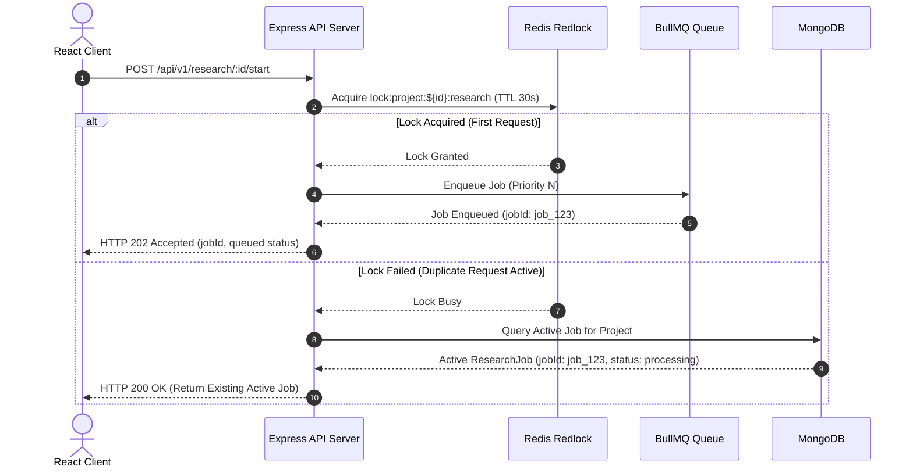
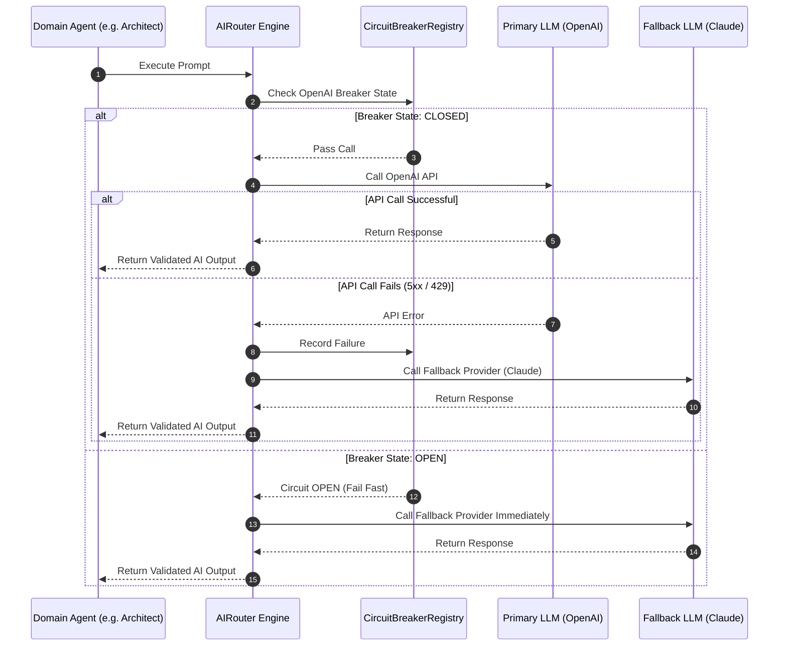
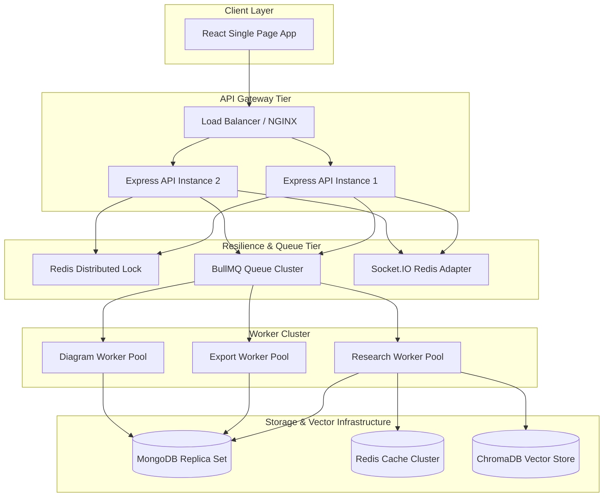

# NEXUS Enterprise Backend Architecture Specification
**Version:** 2.0.0 (Enterprise Resilient Architecture)  
**Author:** Principal Backend Architect & Systems Engineering Team  
**Status:** Approved for Production Implementation  
**Target Audience:** Staff Engineers, Infrastructure Architects, Security Lead, Core Backend Developers  

---

## 1. Executive Overview & Table of Contents

### 1.1 Executive Overview
NEXUS Version 2.0.0 represents an enterprise-grade architectural evolution of the NEXUS AI Research Platform. Designed to support autonomous, enterprise-scale research execution, Version 2.0.0 addresses real-world operational challenges encountered in Version 1.0.0—specifically CPU/memory spikes under high concurrency, redundant provider API calls, worker process crashes, provider outages, and limited output modalities.

This specification documents the complete extended backend architecture. It preserves all working Version 1.0.0 components, routes, database schemas, and API contracts while introducing:
1. **Single-Execution Per Project Guards**: Enforced via Redis distributed locking (`redlock`) and deduplication.
2. **Backpressure & Wait-Time Estimation**: Graceful request queuing with real-time Socket.IO telemetry.
3. **Stage-Level Checkpointing & Crash Recovery**: Fail-safe job state persistence enabling direct stage resume without re-running completed work.
4. **Multi-State Provider Circuit Breakers**: Protected integration wrappers (Closed, Open, Half-Open) across 7 AI providers and 16+ search/data providers with automated fallback.
5. **Multi-Tier Distributed Caching**: Unified L1 LRU and L2 Redis caching framework.
6. **Architecture Diagram Generation Pipeline**: Automated generation of 7 Mermaid AST diagram types with server-side rendering to PNG, SVG, and PDF.
7. **Publication-Grade Export Engine**: Modular exporter for PDF, DOCX, Markdown, HTML, and JSON.
8. **Visual Report Generation Engine**: Dynamic SVG/HTML generation of Gantt charts, market positioning quadrants, feature comparison tables, and dependency graphs.
9. **Expanded Multi-Source Research Engine**: 16+ specialized providers covering academic repositories, code platforms, security databases, package registries, patents, and tech discussions.
10. **Holistic Intelligence Evaluator**: Feasibility scoring, risk matrix generation, cloud/token cost estimation, and Build vs. Buy recommendations.
11. **Autonomous 23-Agent Matrix**: 15 new domain-specialized agents extending system analysis capabilities.
12. **Enterprise Observability & Distributed Tracing**: OpenTelemetry trace context propagation and Prometheus metrics exporter.

---

### 1.2 Table of Contents
- [1. Executive Overview & Table of Contents](#1-executive-overview--table-of-contents)
- [2. Updated Directory & Folder Structure](#2-updated-directory--folder-structure)
- [3. New System Components & Subsystems](#3-new-system-components--subsystems)
- [4. New Execution Flow](#4-new-execution-flow)
- [5. Updated Request Lifecycle](#5-updated-request-lifecycle)
- [6. Updated Queue Architecture](#6-updated-queue-architecture)
- [7. Updated AI Pipeline & Router System](#7-updated-ai-pipeline--router-system)
- [8. Export Pipeline Architecture](#8-export-pipeline-architecture)
- [9. Diagram Generation Pipeline](#9-diagram-generation-pipeline)
- [10. Crash Recovery & Checkpoint Flow](#10-crash-recovery--checkpoint-flow)
- [11. Sequence Diagrams](#11-sequence-diagrams)
- [12. Extended Mermaid Diagrams](#12-extended-mermaid-diagrams)
- [13. Scalability Blueprint (100,000 Users)](#13-scalability-blueprint-100000-users)
- [14. Performance Optimizations](#14-performance-optimizations)
- [15. Security Enhancements](#15-security-enhancements)
- [16. Comprehensive Module Reference](#16-comprehensive-module-reference)
- [17. Architectural Roadmap](#17-architectural-roadmap)

---

## 2. Updated Directory & Folder Structure

The directory layout extends the existing `server/src/` hierarchy cleanly without deleting, renaming, or breaking any existing files.

```text
server/
├── src/
│   ├── agents/                             # Multi-Agent Domain Layer (23 Autonomous Agents)
│   │   ├── prompts/                        # System prompts for all domain agents
│   │   ├── base.agent.ts                   # Abstract BaseAgent enforcing contract validation
│   │   ├── problemUnderstanding.agent.ts   # Stage 1: Problem objective parser
│   │   ├── queryPlanner.agent.ts           # Stage 2: Multi-provider search planner
│   │   ├── deepSearch.agent.ts             # Stage 3: Research aggregator agent
│   │   ├── researchAnalysis.agent.ts       # Stage 4: Claim & solution extractor
│   │   ├── gapFinder.agent.ts              # Stage 5: Market & technical gap detection agent
│   │   ├── critic.agent.ts                 # Stage 6: Stress-testing & vulnerability agent
│   │   ├── architect.agent.ts              # Stage 7: System architecture & Mermaid AST agent
│   │   ├── roadmap.agent.ts                # Stage 8: Milestone & roadmap generation agent
│   │   ├── copilot.agent.ts                # Conversational RAG copilot agent
│   │   │   # --- Version 2.0.0 Extended Agents (15 New Domain Modules) ---
│   │   ├── security.agent.ts               # Threat modeling, OWASP & vulnerability scanner
│   │   ├── performance.agent.ts            # Latency, throughput & caching optimizer
│   │   ├── cost.agent.ts                   # Cloud infrastructure & AI token cost estimator
│   │   ├── architectureReviewer.agent.ts   # Scalability, fault isolation & design reviewer
│   │   ├── codebasePlanner.agent.ts        # Directory topology & design pattern strategist
│   │   ├── devOps.agent.ts                 # CI/CD, Docker, Helm & IaC Terraform agent
│   │   ├── cloud.agent.ts                  # AWS/GCP/Azure resource sizing & topology agent
│   │   ├── database.agent.ts               # Database schema, indexing & sharding strategist
│   │   ├── apiReviewer.agent.ts            # OpenAPI, REST/gRPC contract reviewer
│   │   ├── testing.agent.ts                # Unit, integration & E2E test plan strategist
│   │   ├── compliance.agent.ts             # GDPR, HIPAA & SOC2 compliance auditor
│   │   ├── uiux.agent.ts                   # Design system & component hierarchy agent
│   │   ├── deployment.agent.ts             # Blue-green & canary deployment planner
│   │   ├── monitoring.agent.ts             # Prometheus metrics, alerts & dashboard architect
│   │   ├── optimization.agent.ts           # Code, memory leak & garbage collection profiler
│   │   └── index.ts                        # Agent registry export map
│   ├── ai-output/                          # AI Output Schema Contract Layer
│   │   └── contracts.ts                    # Zod schemas, URL normalizers, JSON parsers
│   ├── cache/                              # Multi-Tier Caching System [NEW]
│   │   ├── CacheManager.ts                 # L1 In-Memory + L2 Redis unified cache interface
│   │   ├── cacheKeys.ts                    # Namespaced key builders & TTL configs
│   │   └── invalidation.ts                 # Tag-based & entity invalidation handler
│   ├── circuit-breaker/                    # Provider Circuit Breaker Layer [NEW]
│   │   ├── CircuitBreaker.ts               # Closed/Open/Half-Open state machine
│   │   ├── CircuitBreakerRegistry.ts       # Central registry for AI & Search breakers
│   │   └── fallbackStrategies.ts           # Fallback provider router logic
│   ├── controllers/                        # Express HTTP API Controllers
│   │   ├── auth.controller.ts              # Authentication & session token management
│   │   ├── copilot.controller.ts           # RAG copilot conversation endpoints
│   │   ├── export.controller.ts            # Report & diagram download endpoints [NEW]
│   │   ├── notification.controller.ts     # User notification read/unread handlers
│   │   ├── project.controller.ts           # Project CRUD & RBAC management
│   │   ├── research.controller.ts          # Pipeline triggers, previews & stage data endpoints
│   │   └── system.controller.ts            # Health, DLQ management & provider status endpoints
│   ├── core/                               # Core Infrastructure Primitives
│   │   ├── config.ts                       # Environment configuration & Zod validator
│   │   ├── database.ts                     # MongoDB connection pool & replica set setup
│   │   ├── errors.ts                       # Standardized AppError hierarchy & status codes
│   │   ├── logger.ts                       # Winston logger with trace correlation
│   │   └── redis.ts                        # Cluster-aware IORedis connection client
│   ├── export/                             # Multi-Format Report Export Engine [NEW]
│   │   ├── ExportService.ts                # Document build orchestrator
│   │   ├── pdf.exporter.ts                 # Puppeteer HTML-to-PDF publication builder
│   │   ├── docx.exporter.ts                # Native Microsoft Word document builder
│   │   ├── markdown.exporter.ts            # Structured Markdown report builder
│   │   ├── html.exporter.ts                # Styled standalone HTML report builder
│   │   └── json.exporter.ts                # Machine-readable JSON export builder
│   ├── intelligence/                       # Advanced Analytics & Quality Scoring [NEW]
│   │   ├── feasibility.analyzer.ts         # Business & technical viability evaluator
│   │   ├── risk.analyzer.ts                # Categorized risk matrix generator
│   │   ├── cost.estimator.ts               # Token & cloud infrastructure budget calculator
│   │   ├── qualityScorer.ts                # Scalability, Security, Maintainability & Performance scorer
│   │   └── buildVsBuy.analyzer.ts          # Commercial vs Open-Source decision engine
│   ├── integrations/                       # LLM Service Integrations & AIRouter
│   │   ├── adapters/                       # Provider-specific implementations
│   │   │   ├── anthropic.provider.ts       # Claude 3.5 Sonnet adapter
│   │   │   ├── deepseek.provider.ts        # DeepSeek V3/R1 adapter
│   │   │   ├── gemini.provider.ts          # Gemini 1.5 Pro adapter
│   │   │   ├── groq.provider.ts            # Groq Llama3 adapter
│   │   │   ├── openai.provider.ts          # OpenAI GPT-4o adapter
│   │   │   ├── openrouter.provider.ts      # OpenRouter aggregator adapter
│   │   │   └── together.provider.ts        # Together AI open model adapter
│   │   ├── AIProvider.ts                   # Provider contract interface & token accounting
│   │   ├── AIRouter.ts                     # Task-aware provider fallback router
│   │   ├── modelRegistry.ts                # Task-to-model allocation matrix
│   │   └── parseAIError.ts                 # Provider error classifier & quota detector
│   ├── middleware/                         # Express HTTP Request Processing Pipeline
│   │   ├── auth.middleware.ts              # Bearer JWT authentication middleware
│   │   ├── backpressure.middleware.ts      # Overload detection & wait-time estimator [NEW]
│   │   ├── errorHandler.middleware.ts     # Global exception logger & response formatter
│   │   ├── projectAuth.ts                  # Project RBAC authorization (Owner, Editor, Viewer)
│   │   ├── projectLock.middleware.ts       # Per-project single execution lock middleware [NEW]
│   │   ├── rateLimit.middleware.ts         # Windowed request rate limiters
│   │   ├── tracing.middleware.ts           # OpenTelemetry trace ID injection middleware [NEW]
│   │   └── validate.middleware.ts          # Request body/params/query Zod validator
│   ├── models/                             # Mongoose Database Models & Schemas
│   │   ├── AIUsageLog.ts                   # Telemetry & cost tracking model
│   │   ├── DiagramArtifact.ts              # Stored Mermaid ASTs and rendered URL assets [NEW]
│   │   ├── EvidenceClaim.ts                # Verified factual claim entity
│   │   ├── ExistingSolution.ts             # Competitor & solution entity
│   │   ├── ExportArtifact.ts               # Generated report export metadata & keys [NEW]
│   │   ├── InnovationGap.ts                # Market & technical gap entity
│   │   ├── JobCheckpoint.ts                # Stage checkpointing & snapshot entity [NEW]
│   │   ├── Notification.ts                 # User notification entity
│   │   ├── Project.ts                      # Core project entity model
│   │   ├── ProjectMember.ts                # Project RBAC membership entity
│   │   ├── ProviderMetricsLog.ts           # Circuit breaker health & telemetry records [NEW]
│   │   ├── RagIndexState.ts                # Chunk indexing state tracking entity
│   │   ├── ResearchJob.ts                  # Job status, stages & progress model
│   │   ├── ResearchSource.ts               # Multi-provider search document entity
│   │   └── User.ts                         # User profile & credential model
│   ├── observability/                      # Distributed Observability Framework [NEW]
│   │   ├── tracing.ts                      # OpenTelemetry tracer & AsyncLocalStorage setup
│   │   ├── metrics.ts                      # Prometheus metrics collector & registry
│   │   └── metricsExporter.ts              # `/metrics` endpoint handler
│   ├── orchestrator/                       # Resilient Pipeline Orchestration Engine
│   │   └── research.orchestrator.ts        # Stage checkpointer & agent chain runner
│   ├── rag/                                # Retrieval-Augmented Generation Subsystem
│   │   ├── chroma.client.ts                # ChromaDB vector store client connector
│   │   ├── chunker.ts                      # Text chunking algorithm
│   │   ├── embedder.ts                     # Text embedding generator
│   │   ├── pipeline.ts                     # Async RAG indexing & context assembly
│   │   └── retriever.ts                    # Cosine similarity vector search engine
│   ├── rendering/                          # Mermaid Diagram Rendering Pipeline [NEW]
│   │   ├── DiagramRenderer.ts              # Mermaid AST rendering manager
│   │   ├── puppeteer.renderer.ts           # Headless Chromium SVG/PNG/PDF renderer
│   │   └── kroki.renderer.ts               # Fallback Kroki microservice renderer
│   ├── research/                           # Search Provider Aggregator Framework
│   │   ├── providers/                      # Provider Implementations (16+ Sources)
│   │   │   ├── ResearchProvider.ts         # Interface & normalized models
│   │   │   ├── arxiv.provider.ts           # arXiv academic papers
│   │   │   ├── awesomeLists.provider.ts    # GitHub Awesome Lists provider [NEW]
│   │   │   ├── datasets.provider.ts        # Benchmark & government datasets provider [NEW]
│   │   │   ├── devto.provider.ts           # Dev.to engineering articles provider [NEW]
│   │   │   ├── dockerHub.provider.ts       # Docker Hub container registry provider [NEW]
│   │   │   ├── docsScraper.provider.ts     # Official technical documentation scraper [NEW]
│   │   │   ├── github.provider.ts          # GitHub code/issues/discussions provider
│   │   │   ├── googlePatents.provider.ts   # Google Patents search provider [NEW]
│   │   │   ├── hackerNews.provider.ts      # Hacker News technical posts provider [NEW]
│   │   │   ├── ieee.provider.ts            # IEEE Xplore paper repository provider [NEW]
│   │   │   ├── medium.provider.ts          # Medium technical blog provider [NEW]
│   │   │   ├── npm.provider.ts             # NPM package registry provider [NEW]
│   │   │   ├── openAlex.provider.ts        # OpenAlex academic citations provider [NEW]
│   │   │   ├── pypi.provider.ts            # PyPI Python package registry provider [NEW]
│   │   │   ├── reddit.provider.ts          # Reddit engineering subreddits provider [NEW]
│   │   │   ├── rfcs.provider.ts            # IETF RFC technical specification provider [NEW]
│   │   │   ├── securityAdvisories.provider.ts # CVE/NVD security vulnerability provider [NEW]
│   │   │   ├── semanticScholar.provider.ts # Semantic Scholar citations provider
│   │   │   ├── serper.provider.ts          # Serper Google Web search provider
│   │   │   ├── stackoverflow.provider.ts   # Stack Overflow API provider [NEW]
│   │   │   └── youtubeTalks.provider.ts    # YouTube tech talk transcript provider [NEW]
│   │   ├── deduplicator.ts                 # URL and title deduplication engine
│   │   ├── normalizer.ts                   # Provider raw response normalizer
│   │   └── providerRegistry.ts             # Concurrent search runner with time-boxing
│   ├── routes/                             # Express REST Route Handlers
│   │   ├── auth.routes.ts
│   │   ├── copilot.routes.ts
│   │   ├── export.routes.ts                # Document export routes [NEW]
│   │   ├── notification.routes.ts
│   │   ├── project.routes.ts
│   │   ├── research.routes.ts
│   │   └── system.routes.ts
│   ├── schemas/                            # Zod HTTP Validation Schemas
│   │   ├── auth.schema.ts
│   │   ├── export.schema.ts                # Export request Zod schema [NEW]
│   │   ├── notification.schema.ts
│   │   ├── project.schema.ts
│   │   └── research.schema.ts
│   ├── socket/                             # Real-Time WebSocket Infrastructure
│   │   ├── handlers.ts                     # Socket room join/leave event handlers
│   │   └── socket.server.ts                # Socket.IO Redis Adapter server setup
│   ├── types/                              # TypeScript Global Type Definitions
│   │   └── express.d.ts                    # Express Request context type extensions
│   ├── utils/                              # Common Helper Functions & Utilities
│   │   ├── asyncHandler.ts                 # Express async exception wrapper
│   │   ├── jwt.ts                          # JWT HMAC-SHA256 sign & verify utility
│   │   ├── response.ts                     # Standardized HTTP JSON response utility
│   │   ├── retry.ts                        # Exponential backoff with jitter helper
│   │   └── safeFetch.ts                    # Time-boxed resilient HTTP fetch client
│   ├── visualization/                      # Report Visualization Engine [NEW]
│   │   ├── ReportVisualizationService.ts   # Chart and diagram asset builder
│   │   ├── gantt.builder.ts                # Gantt timeline chart builder
│   │   ├── quadrant.builder.ts             # 2D Market positioning quadrant chart builder
│   │   └── matrix.builder.ts               # Feature matrix SVG generator
│   └── workers/                            # BullMQ Distributed Background Workers
│       ├── research.worker.ts              # Primary research pipeline worker
│       ├── export.worker.ts                # Async document export worker [NEW]
│       ├── diagram.worker.ts               # Async diagram render worker [NEW]
│       ├── dlq.worker.ts                   # Dead Letter Queue supervisor worker [NEW]
│       └── researchQueue.ts                # BullMQ queue producers & definitions
│   ├── app.ts                              # Express Application Configuration
│   └── server.ts                           # Process Entry Point & Supervisor
```

---

## 3. New System Components & Subsystems

### 3.1 Project-Scoped Execution Guard (`projectLock.middleware.ts`)
To prevent system crashes, CPU spikes, duplicate jobs, and API provider rate limits caused by rapid repeated "Start Research" triggers from the client, Version 2.0.0 enforces strict single-execution project boundaries.
- **Distributed Locking Primitive**: Uses Redis `redlock` with resource key `lock:project:${projectId}:research`.
- **Deduplication Routing**: If a request arrives while a lock is held or an active job exists with status `queued` or `processing`, the controller returns HTTP `200 OK` containing the existing `ResearchJob` payload instead of enqueuing a duplicate job.
- **Lock Heartbeat**: Active worker processes renew the lock TTL (default: 30s) every 10s until pipeline completion.

### 3.2 Backpressure Controller (`backpressure.middleware.ts`)
Under heavy load, the backend must not crash or drop incoming connections.
- **Queue Backpressure Metrics**: Monitors BullMQ queue depth (`queue.getWaitingCount()`).
- **Wait-Time Estimation Engine**: Computes estimated wait time using:
  $$\text{EstimatedWaitTime} = \frac{\text{QueuePosition} \times \bar{T}_{\text{pipeline}}}{\text{WorkerConcurrency}}$$
- **Real-Time Telemetry**: Emits `research:queue_status` events over Socket.IO to the client containing `queuePosition`, `estimatedWaitTimeSeconds`, and `backpressureActive: true`.

### 3.3 Granular Stage Checkpointer (`JobCheckpoint`)
The system guarantees that research progress is preserved across crashes, process restarts, or server redeployments.
- **Checkpoint Data Model**: Mongoose model `JobCheckpoint` and Redis key `checkpoint:job:${jobId}` snapshot stage outputs after each stage finishes.
- **Selective Resume Logic**: When a worker starts a job, it inspects `completedStages`. If Stage 1 through Stage 7 are completed, the worker resumes execution directly at Stage 8, skipping prior stages and preventing redundant AI token costs.

### 3.4 Provider Resilience Circuit Breakers (`CircuitBreakerRegistry`)
Protects external API dependencies (AI providers and Search providers) using `opossum` circuit breakers.
- **3-State Machine**:
  - `CLOSED`: Normal operation. Requests pass through to downstream provider.
  - `OPEN`: Fail fast. Calls immediately return fallback responses or error without invoking provider API. Triggered when failure rate exceeds 50% over a 10-call window.
  - `HALF-OPEN`: Trial state after reset timeout (30s). Limited probe calls test provider recovery.
- **Fallback Integration**: Integrates directly with `AIRouter` to automatically switch providers (e.g. fallback from OpenAI to Anthropic) when a breaker opens.

### 3.5 Multi-Tier Cache Manager (`CacheManager`)
Provides unified L1 (In-Memory LRU) and L2 (Redis Distributed) caching.
- **Namespaced Keys**: `cache:query:*`, `cache:search:*`, `cache:ai:*`, `cache:arch:*`, `cache:tech:*`, `cache:comp:*`, `cache:gap:*`, `cache:rag:*`.
- **Configurable TTL**: Ranging from 6 hours (AI intermediate outputs) to 72 hours (technology recommendations).

### 3.6 Automated Diagram Renderer (`DiagramRendererService`)
Extends `ArchitectAgent` to generate valid Mermaid AST definitions for 7 architectural perspectives and renders them into vector (SVG) and raster (PNG, PDF) assets via headless Puppeteer Chromium or Kroki fallback microservices.

### 3.7 Publication-Grade Export Service (`ExportService`)
Generates structured exports combining executive summaries, evidence claims, competitor comparison matrices, architecture diagrams, and roadmaps in PDF, DOCX, Markdown, HTML, and JSON formats.

### 3.8 Report Visualization Engine (`ReportVisualizationService`)
Dynamically renders custom SVG charts (Gantt timelines, 2D market positioning quadrant charts, feature comparison matrices, dependency graphs) for display in the frontend and inclusion in exports.

### 3.9 Multi-Source Research Engine (16+ Providers)
Broadens research data gathering beyond web search to encompass academic papers, code repositories, package registries, patents, security databases, RFCs, and engineering media.

### 3.10 Holistic Intelligence Evaluator (`src/intelligence/`)
Generates comprehensive analysis modules covering market opportunities, business and technical feasibility scores (0-100), risk matrices, infrastructure and token cost estimates, and Build vs. Buy recommendations.

### 3.11 Enterprise Multi-Agent Matrix (23 Agents)
Expands the multi-agent system from 8 agents to 23 specialized domain agents inheriting from `BaseAgent`.

---

## 4. New Execution Flow

The end-to-end processing pipeline operates through a deterministic, fail-safe sequence:

```
[Client] POST /api/v1/research/:id/start
   │
   ▼
[Express API] projectLock.middleware
   │──► Attempt Redis lock: lock:project:${projectId}:research
   │
   ├──► [Lock Failed / Active Job Running] ──► Return HTTP 200 (Active Job Document)
   │
   └──► [Lock Acquired]
           │
           ▼
[Express API] backpressure.middleware
   │──► Evaluate Queue Depth
   │──► Calculate Estimated Wait Time & Position
   │──► Emit Socket.IO 'research:queue_status'
   │──► Enqueue Job in BullMQ 'research-queue'
   │──► Return HTTP 202 Accepted
           │
           ▼
[BullMQ Worker Pool] research.worker.ts
   │──► Pick up Job
   │──► Fetch JobCheckpoint from Mongo / Redis
   │──► Determine resume stage index K
           │
           ▼
[ResearchOrchestrator Engine]
   │
   ├──► Stage 1: ProblemUnderstandingAgent
   ├──► Stage 2: QueryPlannerAgent
   ├──► Stage 3: DeepSearch (16+ Providers with Circuit Breakers & Cache)
   ├──► Stage 4: ResearchAnalysisAgent
   ├──► Stage 5: GapFinderAgent & Intelligence Evaluators
   ├──► Stage 6: CriticAgent
   ├──► Stage 7: ArchitectAgent (Generates 7 Mermaid ASTs)
   │               └──► Trigger diagram.worker.ts (Render PNG/SVG/PDF)
   └──► Stage 8: RoadmapAgent & Multi-Agent Reviews
           │
           ▼
[Persistence & Vector Indexing]
   │──► Store Sources, Claims, Solutions, Gaps, Diagrams, Roadmap in MongoDB
   │──► Trigger Async RAG Vector Indexing (ChromaDB)
   │──► Update Job Status: 'completed'
   │──► Release Redis Lock
           │
           ▼
[Socket.IO Server] Emit 'research:complete' to project room
```

---

## 5. Updated Request Lifecycle

```text
Browser / Client App
       │ (1) HTTP Request + Authorization Bearer JWT
       ▼
Express App [src/app.ts]
       │ (2) Helmet, CORS, OpenTelemetry Tracing Middleware [tracing.middleware.ts]
       ▼
Rate Limiting Middleware [src/middleware/rateLimit.middleware.ts]
       │ (3) Evaluates IP against rate limit buckets
       ▼
Authentication Middleware [src/middleware/auth.middleware.ts]
       │ (4) Verifies JWT access token via src/utils/jwt.ts, injects req.user
       ▼
Project RBAC Middleware [src/middleware/projectAuth.ts]
       │ (5) Verifies ProjectMember role (Owner / Editor / Viewer) for target projectId
       ▼
Single-Execution Lock Middleware [src/middleware/projectLock.middleware.ts]
       │ (6) Evaluates Redis distributed lock `lock:project:${id}:research`
       ▼
Backpressure Evaluation Middleware [src/middleware/backpressure.middleware.ts]
       │ (7) Evaluates queue backlog depth; computes estimated wait time
       ▼
Zod Request Validation [src/middleware/validate.middleware.ts]
       │ (8) Validates request body, params, and query schemas
       ▼
Research Controller [src/controllers/research.controller.ts]
       │ (9) Enqueues job in BullMQ 'research-queue'
       │ ──► [HTTP Response 202 Accepted returned to client]
       ▼
BullMQ Queue Producer [src/workers/researchQueue.ts]
       │ (10) Adds job to Redis 'bull:research-queue'
       ▼
Background Research Worker [src/workers/research.worker.ts]
       │ (11) Consumes job message, instantiates ResearchOrchestrator
       │ (12) Reads JobCheckpoint state (resumes at stage K if previous attempt crashed)
       ▼
ResearchOrchestrator Engine [src/orchestrator/research.orchestrator.ts]
       │ (13) Executes 23-Agent Multi-Stage Pipeline sequentially
       │ (14) Calls Circuit Breaker wrapped AI Router & Provider Registry
       │ (15) Checks & updates L1/L2 Redis Cache
       │ (16) Snapshots state to JobCheckpoint after each stage
       ▼
Diagram & Export Rendering Services [src/rendering/ & src/export/]
       │ (17) Asynchronously renders Mermaid AST diagrams to PNG/SVG/PDF
       │ (18) Builds document export artifacts on demand
       ▼
MongoDB & ChromaDB Persistence Layers
       │ (19) Bulk-writes entity state; chunks and indexes vectors in ChromaDB
       ▼
Socket.IO Broadcast Server [src/socket/socket.server.ts]
       │ (20) Streams real-time progress and completion telemetry via Redis Adapter
       ▼
React Client (Subscribed via Socket.IO listener)
```

---

## 6. Updated Queue Architecture

Version 2.0.0 replaces single unmanaged job handling with a structured BullMQ multi-queue architecture.

```text
                               Redis Server (BullMQ Store)
                                            │
         ┌──────────────────┬───────────────┴───────────────┬──────────────────┐
         ▼                  ▼                               ▼                  ▼
  'research-queue'   'export-queue'                  'diagram-queue'     'research-dlq'
         │                  │                               │                  │
         ▼                  ▼                               ▼                  ▼
  Research Workers    Export Workers                  Diagram Workers     DLQ Supervisor
  (Concurrency: 5)   (Concurrency: 3)                (Concurrency: 4)    (Manual Replay)
```

### 6.1 Queue Specifications
1. **`research-queue`**: Primary pipeline execution queue.
   - Concurrency: Configurable (`WORKER_CONCURRENCY=5`).
   - Job Priorities: Priority 1 (High Priority / Enterprise) to 10 (Standard).
   - Lock Duration: 30,000ms with automatic heartbeat renewal.
   - Stall Interval: 5,000ms (detects crashed workers and re-assigns jobs).
2. **`export-queue`**: Handles PDF, DOCX, and HTML document generation asynchronously.
   - Dedicated process pool to isolate heavy Puppeteer rendering from research execution.
3. **`diagram-queue`**: Converts Mermaid AST strings into SVG, PNG, and PDF images.
4. **`research-dlq` (Dead Letter Queue)**: Captures unrecoverable jobs exceeding max retry limits (default: 3 retries). Retains failure context for administrative review and re-execution.

---

## 7. Updated AI Pipeline & Router System

The `AIRouter` manages model routing across 7 LLM providers using task-aware allocation, circuit breakers, and automatic fallback chains.

### 7.1 Provider Allocation Matrix (`modelRegistry.ts`)

| Task Category | Primary Provider / Model | Fallback Provider / Model | Rationale |
| :--- | :--- | :--- | :--- |
| **Problem Scope** | OpenAI `gpt-4o` | Anthropic `claude-3-5-sonnet` | High structured parsing accuracy |
| **Search Query Planning** | Groq `llama-3.3-70b` | OpenAI `gpt-4o-mini` | Low latency, fast generation |
| **Research Analysis** | Anthropic `claude-3-5-sonnet` | Google `gemini-1.5-pro` | Deep reasoning & evidence evaluation |
| **Gap Detection** | Anthropic `claude-3-5-sonnet` | DeepSeek `deepseek-r1` | Complex pattern matching |
| **Critic & Stress Test** | DeepSeek `deepseek-r1` | Anthropic `claude-3-5-sonnet` | Formal logic & edge-case discovery |
| **System Architecture** | OpenAI `gpt-4o` | Anthropic `claude-3-5-sonnet` | Strict Mermaid AST code generation |
| **Roadmap Generation** | Google `gemini-1.5-pro` | OpenAI `gpt-4o` | Long context processing |
| **Copilot Chat** | Anthropic `claude-3-5-sonnet` | OpenAI `gpt-4o` | Conversational precision |

### 7.2 Provider Fallback Routing Protocol
If an AI invocation fails or its circuit breaker is `OPEN`:
1. `AIRouter` catches the failure via `parseAIError.ts`.
2. Telemetry logs the incident and increments `ai_provider_errors_total` counter.
3. Router fetches the designated Fallback Provider from `modelRegistry.ts`.
4. Invokes fallback provider transparently without failing the underlying stage.

---

## 8. Export Pipeline Architecture

The `ExportService` compiles research assets into downloadable documents.

```text
               Export Request: GET /api/v1/export/:projectId/:format
                                          │
                                          ▼
                                ExportService Manager
                                          │
        ┌─────────────────────────────────┼─────────────────────────────────┐
        ▼                                 ▼                                 ▼
   PDF Exporter                     DOCX Exporter                    Markdown / HTML / JSON
(Puppeteer HTML-to-PDF)           (Native docx Engine)             (Structured Templating)
        │                                 │                                 │
        └─────────────────────────────────┼─────────────────────────────────┘
                                          ▼
                             ExportArtifact Record Created
                           (S3 Storage Key + Download URL)
                                          │
                                          ▼
                           Binary File Stream to Client
```

### 8.1 Format Exporter Technical Breakdown
- **PDF Exporter (`pdf.exporter.ts`)**: Converts HTML templates into PDF using Puppeteer. Supports running headers/footers, dynamic page numbering, custom cover pages, and embedded SVG diagrams.
- **DOCX Exporter (`docx.exporter.ts`)**: Constructs native Microsoft Word documents using the `docx` library, generating styled tables, callouts, lists, and embedded images.
- **Markdown / HTML / JSON Exporters**: Generates structured plain text, HTML, and JSON representations of all project entities.

---

## 9. Diagram Generation Pipeline

The architecture generation agent (`ArchitectAgent`) outputs valid Mermaid AST code for 7 system perspectives. The `DiagramRendererService` processes these AST definitions into renderable image formats.

```text
         ArchitectAgent Generates 7 Mermaid AST Definitions
                                  │
                                  ▼
           Persist ASTs in DiagramArtifact MongoDB Schema
                                  │
                                  ▼
         DiagramRendererService / Async Diagram Worker
                                  │
        ┌─────────────────────────┼─────────────────────────┐
        ▼                         ▼                         ▼
 Headless Chromium          SVG Processing            Kroki Microservice
 (Puppeteer PNG Render)     (Vector Generation)       (Fallback Service)
        │                         │                         │
        └─────────────────────────┼─────────────────────────┘
                                  ▼
                Upload Rendered Assets to S3 / Local Store
                Attach URLs to Project Architecture Model
```

### 9.1 Supported Architectural Perspectives
1. **Flowchart Diagram**: End-to-end data flow & user pipeline.
2. **Sequence Diagram**: Microservice & API interaction flow.
3. **ER Diagram**: Database domain data models & relationships.
4. **Component Diagram**: Modular system architecture breakdown.
5. **Class Diagram**: Object-oriented entity interfaces.
6. **Deployment Diagram**: Container, Kubernetes node & load balancer topology.
7. **Infrastructure Diagram**: Cloud network infrastructure (VPC, Subnets, Gateways).

---

## 10. Crash Recovery & Checkpoint Flow

```text
         Worker Begins Processing Stage K
                        │
                        ▼
            Stage K Completes Cleanly
                        │
                        ▼
        Write Snapshot to Mongo & Redis:
        JobCheckpoint: stage_k_output
        Set completedStages = [1..k]
                        │
                        ▼
   [PROCESS CRASH OR WORKER RESTART OCCURS]
                        │
                        ▼
    BullMQ Stall Detector Re-enqueues Job
                        │
                        ▼
   Worker Reads JobCheckpoint from DB/Redis
                        │
        ┌───────────────┴───────────────┐
        ▼                               ▼
  Stages 1..K Completed           Stage K+1 Pending
     SKIPPED                       RESUMED (Executes Stage K+1)
```

---

## 11. Sequence Diagrams

### 11.1 Request Throttling & Deduplication Flow


### 11.2 Provider Circuit Breaker & Fallback Flow


---

## 12. Extended Mermaid Diagrams

### 12.1 System Component Topology Diagram


---

## 13. Scalability Blueprint (100,000 Users)

To support enterprise workloads up to 100,000 active users and 10,000 daily research runs, Version 2.0.0 defines a horizontally scalable topology:

```text
                           Load Balancer (NGINX / AWS ALB)
                                         │
           ┌─────────────────────────────┼─────────────────────────────┐
           ▼                             ▼                             ▼
   API Node 1 (Stateless)        API Node 2 (Stateless)        API Node N (Stateless)
           │                             │                             │
           └─────────────────────────────┼─────────────────────────────┘
                                         │
                               Socket.IO Redis Adapter
                                         │
           ┌─────────────────────────────┴─────────────────────────────┐
           ▼                                                           ▼
    Redis Cluster (Sharded)                                   Mongo Replica Set
(Distributed Locks, Queues, Cache)                          (Primary + Secondary Read)
           │                                                           │
           └─────────────────────────────┬─────────────────────────────┘
                                         │
                   ┌─────────────────────┴─────────────────────┐
                   ▼                                           ▼
         Worker Node Cluster 1                       Worker Node Cluster N
        (BullMQ Research Pool)                      (BullMQ Export / Diagram Pool)
```

### 13.1 Scalability Controls
- **Stateless API Layer**: API servers maintain no session state in memory. JWT tokens are verified statelessly, enabling horizontal pod auto-scaling (HPA) based on CPU/memory thresholds.
- **WebSocket Scaling**: Multi-node Socket.IO instances synchronize state via `@socket.io/redis-adapter` pub/sub.
- **Database Scaling**: Read operations leverage MongoDB `secondaryPreferred` read preferences, reserving the primary node for transactional writes and stage checkpoints.
- **Cache Sharding**: Redis Cluster distributes key namespaces (`cache:*`, `lock:*`, `bull:*`) across sharded master nodes.

---

## 14. Performance Optimizations

1. **Multi-Layer Caching**: Reduces search provider and LLM API costs by up to 60% through L1 in-memory LRU and L2 Redis distributed caching.
2. **Database Indexing Strategy**:
   - `User`: `{ email: 1 }` (unique)
   - `Project`: `{ userId: 1, updatedAt: -1 }`
   - `ResearchJob`: `{ projectId: 1, status: 1 }`
   - `JobCheckpoint`: `{ jobId: 1 }` (unique)
   - `ResearchSource`: `{ researchJobId: 1, sourceHash: 1 }` (unique)
   - `ExportArtifact`: `{ expiresAt: 1 }` (TTL index)
3. **Headless Chromium Pool Reuse**: Puppeteer instances for PDF generation and diagram rendering are managed in a warm browser pool to reduce cold-start latency.
4. **Batch Persistence**: DB writes for sources, evidence claims, solutions, and gaps use `bulkWrite` upsert operations to reduce database round-trips.

---

## 15. Security Enhancements

1. **Input & Output Validation**: All client payloads and AI outputs are validated against strict Zod schemas, stripping malicious HTML/scripts to prevent XSS and prompt injection attacks.
2. **Project RBAC Enforcer**: `projectAuth.ts` middleware verifies `Owner`, `Editor`, or `Viewer` permissions prior to resource access.
3. **Cryptographic Security**: Passwords hashed via `bcryptjs` (12 rounds). Short-lived JWT access tokens (15m) paired with refresh token rotation.
4. **Rate Limiting**: Multi-tiered rate limiters protect authentication (`authLimiter`), general API access (`generalLimiter`), and heavy research operations (`researchMutationLimiter`).
5. **Observability Auditing**: OpenTelemetry `traceId` context attached to all log output for security compliance auditing.

---

## 16. Comprehensive Module Reference

### 16.1 Extended Agents (15 New Modules)
- `security.agent.ts`: Threat modeling, OWASP Top 10 analysis, vulnerability scanning.
- `performance.agent.ts`: Latency targets, caching design, throughput bottleneck analysis.
- `cost.agent.ts`: Cloud resource sizing & AI token consumption cost estimation.
- `architectureReviewer.agent.ts`: System design stress-testing & scalability evaluation.
- `codebasePlanner.agent.ts`: Project directory layout & architectural pattern recommendations.
- `devOps.agent.ts`: CI/CD pipeline automation, Docker containerization, IaC Terraform scripts.
- `cloud.agent.ts`: Multi-cloud resource mapping (AWS, GCP, Azure).
- `database.agent.ts`: Database normalization, index optimization, sharding design.
- `apiReviewer.agent.ts`: REST/gRPC/OpenAPI contract design & validation.
- `testing.agent.ts`: Unit, integration, and E2E test plan strategies.
- `compliance.agent.ts`: GDPR, HIPAA, and SOC2 compliance auditing.
- `uiux.agent.ts`: Frontend design system & component hierarchy recommendations.
- `deployment.agent.ts`: Zero-downtime blue-green and canary release strategies.
- `monitoring.agent.ts`: Prometheus metrics, Winston alerts, Grafana dashboard design.
- `optimization.agent.ts`: Memory leak, GC tuning, code efficiency profiler.

### 16.2 Extended Search Providers (17 Total)
- Academic: `arxiv.provider.ts`, `semanticScholar.provider.ts`, `ieee.provider.ts`, `openAlex.provider.ts`
- Code & Community: `github.provider.ts`, `stackoverflow.provider.ts`, `reddit.provider.ts`, `devto.provider.ts`, `medium.provider.ts`, `hackerNews.provider.ts`
- Registries & Docs: `npm.provider.ts`, `pypi.provider.ts`, `dockerHub.provider.ts`, `docsScraper.provider.ts`, `awesomeLists.provider.ts`
- Datasets & Patents: `googlePatents.provider.ts`, `youtubeTalks.provider.ts`, `datasets.provider.ts`, `securityAdvisories.provider.ts`, `rfcs.provider.ts`

---

## 17. Architectural Roadmap

```text
  Phase 1: Resiliency & Execution Control (Q3 2026)
  ├── Deploy Redis Distributed Locks & Deduplication Middleware
  ├── Implement Backpressure Estimator & Queue Telemetry
  ├── Roll out Stage Checkpointing & Fail-Safe Resume Engine
  └── Deploy Multi-State Circuit Breakers for AI & Search Providers

  Phase 2: Multi-Modal Output & Render Engines (Q4 2026)
  ├── Deploy ArchitectAgent Mermaid AST Generator (7 Views)
  ├── Implement Puppeteer & Kroki Diagram Renderer Pipeline
  ├── Deploy Multi-Format Export Engine (PDF, DOCX, Markdown, HTML, JSON)
  └── Implement Report Visualization Service (Gantt, Quadrants, Matrices)

  Phase 3: Autonomous Agent Matrix Expansion (Q1 2027)
  ├── Integrate 15 New Domain Agents into Orchestrator Engine
  ├── Expand Search Provider Registry to 16+ Data Sources
  └── Implement Advanced Feasibility, Risk, and Cost Scoring Engines

  Phase 4: Global Enterprise Scale (Q2 2027)
  ├── Migrate to Multi-Region Active-Active API Deployment
  ├── Implement OpenTelemetry Tracing & Prometheus Exporters
  └── Upgrade to Sharded Redis Cluster and MongoDB Replica Sets
```
