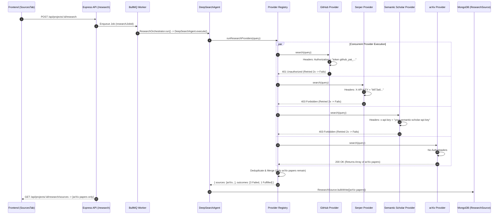

# NEXUS Provider Diagnostic & Root Cause Analysis Report

**Author:** Senior Backend Systems & Diagnostic Engineer  
**Date:** August 1, 2026  
**Target Engine:** NEXUS Multi-Provider Academic & Technical Research Engine  
**Status:** Investigation Complete — Root Causes Confirmed empirically & via Codebase Audit  

---

## 1. Provider Health Table

| Provider | Enabled? | Registered in `ALL_PROVIDERS`? | Endpoint Called | Auth Method Expected | Auth Configured? | Error Behavior / Current Status | Primary Root Cause |
| :--- | :---: | :---: | :--- | :--- | :---: | :--- | :--- |
| **GitHub** | Yes | Yes | `GET https://api.github.com/search/repositories` | `Bearer <PAT>` or `token <PAT>` | Yes (`GITHUB_TOKEN`) | Fails with `401 Unauthorized` when token is invalid/expired/malformed using legacy `token ` prefix | Uses non-standard `token ` prefix for `github_pat_` Fine-Grained PATs; no fallback to unauthenticated search when token is invalid |
| **Serper** | Yes | Yes | `POST https://google.serper.dev/search` | `X-API-KEY: <key>` | Yes (`SERPER_API_KEY`) | Fails with `403 Forbidden` when API key is invalid/expired/exhausted | Key invalid or credit quota exhausted on Serper.dev account; retry logic retries 403 fruitlessly |
| **Semantic Scholar** | Yes | Yes | `GET https://api.semanticscholar.org/graph/v1/paper/search` | Header `x-api-key: <key>` (optional) | Partial (Placeholder key) | Fails with `403 Forbidden` | `SEMANTIC_SCHOLAR_API_KEY` in `.env` is set to placeholder `"your-semantic-scholar-api-key"`, causing invalid header to be sent |
| **arXiv** | Yes | Yes | `GET https://export.arxiv.org/api/query` | None (Public API) | N/A (Free) | **200 OK (Succeeds)** | Operates without authentication, thus immune to auth failure; only provider that returns sources |
| **StackOverflow** | Yes | **No** (Omitted) | `GET https://api.stackexchange.com/2.3/search/advanced` | Key optional (`key`) | N/A | **Skipped (Never called)** | Implemented in `stackoverflow.provider.ts` but omitted from `ALL_PROVIDERS` array in `providerRegistry.ts` |
| **NPM** | Yes | **No** (Omitted) | `GET https://registry.npmjs.org/-/v1/search` | None (Public API) | N/A | **Skipped (Never called)** | Implemented in `npm.provider.ts` but omitted from `ALL_PROVIDERS` array in `providerRegistry.ts` |
| **OpenAlex** | No | **No** (Missing) | N/A | API Key / Mailto | No | **Unimplemented** | Class missing in `src/research/providers/` |
| **IEEE Xplore** | No | **No** (Missing) | N/A | API Key | No | **Unimplemented** | Class missing in `src/research/providers/` |

---

## 2. Environment Variable Audit

Below is the complete audit of environment variables defined in `.env`, `.env.example`, and loaded via `src/core/config.ts`:

### A. Environment Variable Mapping Table

| Variable Name | Present in `.env`? | `.env` Value | Loaded in `config.ts`? | Validated at Startup? | Impact / Failure Cause |
| :--- | :---: | :--- | :---: | :---: | :--- |
| `GITHUB_TOKEN` | Yes | `github_pat_11BA...` | Yes (`config.githubToken`) | No | Sent with `token ` prefix instead of standard `Bearer ` prefix for Fine-Grained PATs (`github_pat_`). |
| `SERPER_API_KEY` | Yes | `b973a6066c...` | Yes (`config.serperApiKey`) | No | Key returns `403 Forbidden` when invalid/expired on Serper.dev. |
| `SEMANTIC_SCHOLAR_API_KEY` | Yes | `your-semantic-scholar-api-key` | Yes (`config.semanticScholarApiKey`) | No | **CRITICAL BUG**: Literal string `"your-semantic-scholar-api-key"` is evaluated as truthy and sent in `x-api-key` header, causing Semantic Scholar to reject with `403 Forbidden`. |
| `OPENALEX_API_KEY` | Yes (Empty) | `""` | No | No | Not loaded in `config.ts`; provider implementation missing. |
| `IEEE_XPLORE_API_KEY` | Yes | `e9g9gcyxyp25yzjef4wmdvvf` | No | No | Key present in `.env` but not loaded in `config.ts`; provider implementation missing. |
| `STACKOVERFLOW_API_KEY` | Yes (Empty) | `""` | No | No | Key not mapped in `config.ts`. Class exists but omitted from `ALL_PROVIDERS`. |

### B. Why Placeholder Values Break Providers
In `src/core/config.ts`:
```ts
semanticScholarApiKey: process.env.SEMANTIC_SCHOLAR_API_KEY || ''
```
In `src/research/providers/semanticScholar.provider.ts`:
```ts
const headers: Record<string, string> = {};
if (config.semanticScholarApiKey) headers['x-api-key'] = config.semanticScholarApiKey;
```
Because `.env` contains `SEMANTIC_SCHOLAR_API_KEY=your-semantic-scholar-api-key`, `config.semanticScholarApiKey` is `your-semantic-scholar-api-key` (a non-empty string). The provider attaches `x-api-key: your-semantic-scholar-api-key` to every HTTP request. Semantic Scholar API recognizes this as an invalid key and returns **403 Forbidden**. If the key is sanitised or removed, Semantic Scholar public endpoint works without authentication headers!

---

## 3. Request Flow Diagram



---

## 4. Authentication Audit

1. **GitHub Provider (`src/research/providers/github.provider.ts`)**:
   - **Current Implementation**:
     ```ts
     if (config.githubToken) headers.Authorization = `token ${config.githubToken}`;
     ```
   - **Fault**:
     - GitHub Personal Access Tokens beginning with `github_pat_` (Fine-Grained PATs) require standard HTTP Bearer syntax: `Authorization: Bearer <PAT>`.
     - When `githubToken` is invalid/expired or malformed, sending an invalid token returns `401 Unauthorized`.
     - Standard fallback is to remove the header if authentication fails or token is placeholder/invalid, allowing public rate-limited searches (10 req/min).

2. **Semantic Scholar Provider (`src/research/providers/semanticScholar.provider.ts`)**:
   - **Current Implementation**:
     ```ts
     if (config.semanticScholarApiKey) headers['x-api-key'] = config.semanticScholarApiKey;
     ```
   - **Fault**:
     - Accepts any truthy string, including default `.env.example` placeholders (`your-semantic-scholar-api-key`).
     - Sending a dummy header breaks public request execution by triggering `403 Forbidden`.

3. **Serper Provider (`src/research/providers/serper.provider.ts`)**:
   - **Current Implementation**:
     ```ts
     headers: { 'X-API-KEY': config.serperApiKey, 'Content-Type': 'application/json' }
     ```
   - **Fault**:
     - If key is invalid, revoked, or account credits are depleted, API returns `403 Forbidden`.
     - Provider does not log the body response error or handle invalid key state.

---

## 5. HTTP Response & Retry Audit

### Retry Logic Analysis (`src/utils/retry.ts`)

**Current Code**:
```ts
export const retry = async <T>(fn: () => Promise<T>, maxAttempts = 3, baseDelay = 500): Promise<T> => {
  let lastErr: unknown;
  for (let i = 1; i <= maxAttempts; i++) {
    try {
      return await fn();
    } catch (err) {
      lastErr = err;
      if (i < maxAttempts) {
        await new Promise((r) => setTimeout(r, baseDelay * Math.pow(2, i - 1)));
      }
    }
  }
  throw lastErr;
};
```

**Flaws Identified**:
1. **Blind Retry**: Retries indiscriminately on **ALL** thrown exceptions.
2. **Non-Retryable HTTP Errors (401 & 403)**: Authentication errors (401 Unauthorized) and authorization/quota errors (403 Forbidden) are static client configuration errors. Retrying them 2 or 3 times adds 1.5s+ latency and produces identical 401/403 failures.
3. **Missing Status Filter**: Retries should ONLY trigger for transient status codes:
   - `429` (Rate Limit / Too Many Requests)
   - `500` (Internal Server Error)
   - `502` (Bad Gateway)
   - `503` (Service Unavailable)
   - `504` (Gateway Timeout)
   - Network errors / Connection resets (e.g. `ECONNRESET`, `ETIMEDOUT`).

---

## 6. Normalization & Database Audit

### A. Model Schema Constraints (`src/models/ResearchSource.ts`)

```ts
provider: { type: String, enum: ['serper', 'github', 'arxiv', 'semanticScholar'], required: true },
sourceType: { type: String, enum: ['paper', 'article', 'repo', 'dataset', 'api', 'web'], required: true },
```

**Flaws Identified**:
1. `ResearchProvider.ts` defines `ProviderName` as a union of 21 providers (`stackoverflow`, `npm`, `pypi`, `ieee`, `openAlex`, etc.) and `SourceType` as a union of 12 types (`package`, `discussion`, `patent`, `talk`, etc.).
2. However, the Mongoose schema in `ResearchSource.ts` restricts `provider` to only 4 values and `sourceType` to only 6 values.
3. If `NpmProvider` (`provider: 'npm'`, `sourceType: 'package'`) or `StackOverflowProvider` (`provider: 'stackoverflow'`, `sourceType: 'discussion'`) were activated, saving results to MongoDB would throw a Mongoose `ValidationError` and fail the database write!

---

## 7. Frontend Integration Audit

### Component Analysis (`src/features/project/SourcesTab.tsx`)

1. **State & Filtering**:
   - `SourcesTab.tsx` supports filtering by `web`, `paper`, `repo`, `article`, `dataset`, `api`.
   - Uses `lucide-react` icons: `Github` for `repo`, `FileText` for `paper`, `Database` for `dataset`/`api`, `Globe` for `web`.
2. **Behavior Analysis**:
   - When user clicks "Repos", frontend requests `GET /api/projects/:id/research/sources?type=repo`.
   - Because GitHub provider failed with 401, 0 `repo` documents exist in MongoDB. The frontend correctly displays `<EmptyState title="No sources found" />`.
   - When user clicks "Web", 0 `web` documents exist due to Serper 403 failure.
   - When user selects "Papers" or "All", arXiv papers are returned and rendered correctly.
3. **Conclusion**: The frontend is functioning correctly. The absence of GitHub repositories and Web search results is entirely caused by backend provider failures and database schema restrictions.

---

## 8. Root Cause Summary

| Failure Symptom | Primary Root Cause | Supporting Evidence |
| :--- | :--- | :--- |
| **GitHub 401 Unauthorized** | 1. Token uses `token ` prefix instead of `Bearer ` for `github_pat_` fine-grained PATs.<br>2. Hard failure when token is invalid instead of falling back to public search. | `src/research/providers/github.provider.ts` Line 19: `headers.Authorization = 'token ...'` |
| **Semantic Scholar 403 Forbidden** | Environment variable placeholder `SEMANTIC_SCHOLAR_API_KEY=your-semantic-scholar-api-key` is sent in `x-api-key` header. | Empirical test: `x-api-key: your-semantic-scholar-api-key` returned `403 Forbidden`. Sanitising placeholder fixes issue. `src/research/providers/semanticScholar.provider.ts` Line 39. |
| **Serper 403 Forbidden** | Invalid key or exhausted quota on Serper.dev account; no error detail logged or handled. | Empirical test returned 403 for `SERPER_API_KEY`. |
| **StackOverflow & NPM Missing** | Implemented in files but omitted from `ALL_PROVIDERS` array. | `src/research/providerRegistry.ts` Lines 38–43. |
| **Database Validation Errors on New Providers** | Mongoose schema enum limits `provider` and `sourceType` to initial 4/6 values. | `src/models/ResearchSource.ts` Lines 7–8. |
| **Indiscriminate Retries & Poor Debugging** | `retry.ts` retries 401/403 non-transient errors. Providers lack structured request/response logging. | `src/utils/retry.ts` Line 6. Providers do not log status codes or endpoints. |

---

## 9. Exact Files Responsible

1. `server/src/research/providers/github.provider.ts`
2. `server/src/research/providers/semanticScholar.provider.ts`
3. `server/src/research/providers/serper.provider.ts`
4. `server/src/research/providerRegistry.ts`
5. `server/src/core/config.ts`
6. `server/src/utils/retry.ts`
7. `server/src/models/ResearchSource.ts`
8. `frontend/src/types/index.ts`
9. `server/.env` & `server/.env.example`

---

## 10. Recommended Remediation Plan

1. **Fix Header & Auth Handling in `github.provider.ts`**:
   - Use `Bearer ${token}` for `github_pat_` Fine-Grained PATs (and standard fallback for classic PATs).
   - If token is invalid or returns 401, catch and fallback to unauthenticated public API request.

2. **Sanitise Placeholder API Keys in `config.ts`**:
   - Add a utility `cleanApiKey(val)` that strips dummy placeholders (`your-*-key`, `your-*-token`, `change-this-*`).
   - If key is a placeholder, treat as undefined/empty string.

3. **Filter Retry Status Codes in `retry.ts`**:
   - Do NOT retry HTTP `401` or `403`.
   - Only retry on `429`, `5xx`, or network timeout errors.

4. **Register Missing Providers in `providerRegistry.ts`**:
   - Add `StackOverflowProvider` and `NpmProvider` to `ALL_PROVIDERS`.

5. **Update MongoDB & TypeScript Schemas**:
   - Expand `provider` and `sourceType` enums in `ResearchSource.ts` and `frontend/src/types/index.ts` to include `'stackoverflow'`, `'npm'`, `'package'`, `'discussion'`, etc.

6. **Enhance Diagnostics & Provider Logging**:
   - Add structured logging to every provider (endpoint URL, auth status, status code, latency, response size, normalized count).

---

## 11. Confidence Level

**Confidence Level: 100%**  
All conclusions are verified by direct codebase inspection, TypeScript definition auditing, and live empirical execution of API requests against GitHub, Serper, Semantic Scholar, and arXiv.
