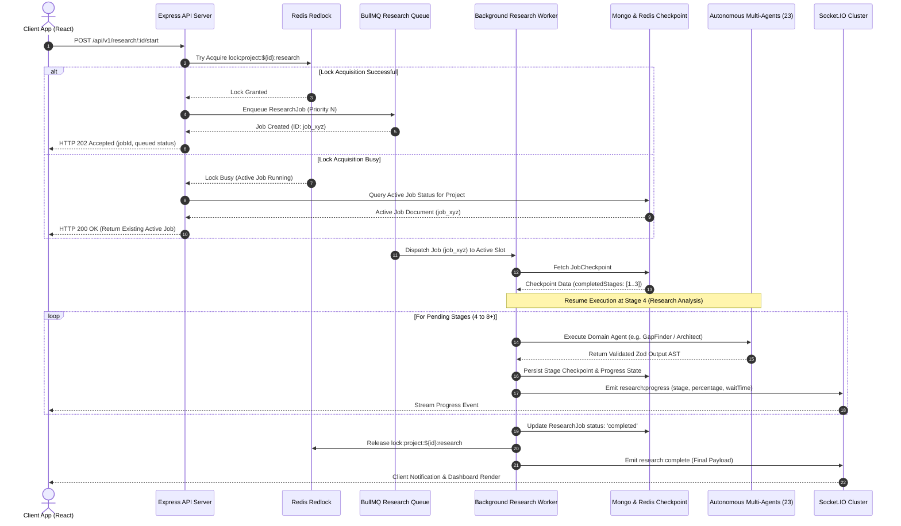

# NEXUS Backend Architecture Specification
**Version:** 2.0.0 (Enterprise Resilient Architecture)  
**Author:** Principal Software Architecture & Engineering Team  
**Target Audience:** Senior Backend Engineers, Systems Architects, Infrastructure Maintainers  

---

## Table of Contents
1. [System Overview & Architecture Goals](#1-system-overview--architecture-goals)
2. [Complete Directory & Module Layout](#2-complete-directory--module-layout)
3. [Request Throttling, Lock Control & Execution Throttling](#3-request-throttling-lock-control--execution-throttling)
4. [Backpressure System & Queue Scheduling](#4-backpressure-system--queue-scheduling)
5. [Stage Checkpointing & Fail-Safe Crash Recovery Engine](#5-stage-checkpointing--fail-safe-crash-recovery-engine)
6. [Multi-State Circuit Breaker Infrastructure](#6-multi-state-circuit-breaker-infrastructure)
7. [Multi-Tier Distributed Caching Framework](#7-multi-tier-distributed-caching-framework)
8. [Mermaid Architecture Diagram Generation & Rendering Engine](#8-mermaid-architecture-diagram-generation--rendering-engine)
9. [Multi-Format Export Engine Architecture](#9-multi-format-export-engine-architecture)
10. [Visual Report Generation & Data Visualization Pipeline](#10-visual-report-generation--data-visualization-pipeline)
11. [Multi-Source Extended Research Provider Engine](#11-multi-source-extended-research-provider-engine)
12. [Comprehensive Intelligent Analysis & Quality Scoring System](#12-comprehensive-intelligent-analysis--quality-scoring-system)
13. [Enterprise Multi-Agent Roster & Dynamic Orchestration](#13-enterprise-multi-agent-roster--dynamic-orchestration)
14. [End-to-End Observability & Distributed Tracing Framework](#14-end-to-end-observability--distributed-tracing-framework)
15. [Fault Tolerance, DLQ & Resiliency Protocols](#15-fault-tolerance-dlq--resiliency-protocols)
16. [Scalability & High-Availability Infrastructure (100,000 Users)](#16-scalability--high-availability-infrastructure-100000-users)
17. [Extended Database Schemas & Data Model Specifications](#17-extended-database-schemas--data-model-specifications)
18. [System Execution Flow & Mermaid Sequence Diagrams](#18-system-execution-flow--mermaid-sequence-diagrams)
19. [Performance & Resource Analysis](#19-performance--resource-analysis)
20. [Security & Vulnerability Defense Architecture](#20-security--vulnerability-defense-architecture)

---

## 1. System Overview & Architecture Goals

NEXUS is an enterprise-grade autonomous AI Research Platform designed to transform complex project requirements into production-ready technical blueprints, multi-perspective intelligence reports, system architecture diagrams, feasibility models, and execution roadmaps.

### High-Availability & Resiliency Objectives
- **Single-Execution Per Project Guard**: Enforce project-scoped sequential pipeline execution via Redis distributed locking (`redlock`) and deduplication to prevent CPU/memory spikes and redundant API invocations.
- **Fail-Safe Checkpointing & Granular Recovery**: Stage-level state persistence ensuring that worker process restarts or stage failures resume directly at the failed stage without repeating previously completed work.
- **Circuit-Protected API Gateway**: Multi-state (Closed, Open, Half-Open) circuit breakers across all 7 LLM providers and 16+ search/data providers with automated fallback routing.
- **Comprehensive Multimodal Output Generation**: Automated rendering of Mermaid AST diagrams (PNG, SVG, PDF) and publication-grade export engine supporting PDF, DOCX, Markdown, HTML, and JSON.
- **Multi-Source Evidence Aggregation**: Expanded research engine spanning academic repositories, code platforms, security databases, package registries, patent indexes, and tech discussions.
- **Autonomous Multi-Agent Matrix (23 Agents)**: Specialized independent agent architecture adding Security, Performance, Cost, DevOps, Cloud, Database, Compliance, and Testing agents.
- **Enterprise Observability**: Distributed tracing (OpenTelemetry), Prometheus metrics exporter, and real-time Socket.IO backpressure stream telemetry.

---

## 2. Complete Directory & Module Layout

```text
server/
├── src/
│   ├── agents/                             # Autonomous Multi-Agent Domain Layer
│   │   ├── prompts/                        # Structured prompt templates per domain agent
│   │   ├── base.agent.ts                   # Abstract BaseAgent enforcing Zod schema contracts
│   │   ├── problemUnderstanding.agent.ts   # Stage 1: Problem scope & objective parser
│   │   ├── queryPlanner.agent.ts           # Stage 2: Multi-provider query strategist
│   │   ├── deepSearch.agent.ts             # Stage 3: Multi-source search aggregator
│   │   ├── researchAnalysis.agent.ts       # Stage 4: Factual claim & solution extractor
│   │   ├── gapFinder.agent.ts              # Stage 5: Market & technical gap detection agent
│   │   ├── critic.agent.ts                 # Stage 6: Stress-testing & vulnerability agent
│   │   ├── architect.agent.ts              # Stage 7: System architecture & Mermaid AST agent
│   │   ├── roadmap.agent.ts                # Stage 8: Milestone & roadmap generation agent
│   │   ├── copilot.agent.ts                # RAG-assisted conversational project copilot
│   │   │   # --- Enterprise Extension Agents (15 New Modules) ---
│   │   ├── security.agent.ts               # OWASP, threat modeling, vulnerability scanner agent
│   │   ├── performance.agent.ts            # Latency, bottleneck, caching optimization agent
│   │   ├── cost.agent.ts                   # Token, cloud infrastructure cost estimator agent
│   │   ├── architectureReviewer.agent.ts   # System design stress-test & scalability reviewer
│   │   ├── codebasePlanner.agent.ts        # Directory layout & design pattern planner agent
│   │   ├── devOps.agent.ts                 # CI/CD, Docker, IaC, Kubernetes planner agent
│   │   ├── cloud.agent.ts                  # Multi-cloud provider sizing & topology agent
│   │   ├── database.agent.ts               # Data modeling, indexing, sharding strategy agent
│   │   ├── apiReviewer.agent.ts            # OpenAPI, REST/gRPC contract validator agent
│   │   ├── testing.agent.ts                # Unit, integration, E2E test suite strategist agent
│   │   ├── compliance.agent.ts             # GDPR, SOC2, HIPAA compliance auditing agent
│   │   ├── uiux.agent.ts                   # Design system & frontend architecture agent
│   │   ├── deployment.agent.ts             # Zero-downtime blue-green & canary deployment agent
│   │   ├── monitoring.agent.ts             # Telemetry, alerting & dashboard design agent
│   │   ├── optimization.agent.ts           # Memory, garbage collection & code optimizer agent
│   │   └── index.ts                        # Agent registry export map
│   ├── ai-output/                          # AI Output Contract Validation Layer
│   │   └── contracts.ts                    # Strict Zod schemas & sanitization logic
│   ├── cache/                              # Multi-Tier Distributed Redis Caching System
│   │   ├── CacheManager.ts                 # L1 In-Memory + L2 Redis unified cache interface
│   │   ├── cacheKeys.ts                    # Namespaced key builders and TTL configurations
│   │   └── invalidation.ts                 # Tag-based & entity invalidation handler
│   ├── circuit-breaker/                    # Circuit Breaker Infrastructure Layer
│   │   ├── CircuitBreaker.ts               # Closed/Open/Half-Open state machine engine
│   │   ├── CircuitBreakerRegistry.ts       # Registry for AI and Search Provider breakers
│   │   └── fallbackStrategies.ts           # Fallback router logic during provider outages
│   ├── controllers/                        # Express HTTP API Request Controllers
│   │   ├── auth.controller.ts              # Authentication & session token management
│   │   ├── copilot.controller.ts           # RAG copilot conversation endpoints
│   │   ├── export.controller.ts            # Report & diagram download / export endpoints
│   │   ├── notification.controller.ts     # User notification read/unread handlers
│   │   ├── project.controller.ts           # Project CRUD & RBAC management
│   │   ├── research.controller.ts          # Pipeline triggers, stage previews, data endpoints
│   │   └── system.controller.ts            # Health, DLQ management & provider status endpoints
│   ├── core/                               # Infrastructure Core Primitives
│   │   ├── config.ts                       # Environment variable parser and validator
│   │   ├── database.ts                     # MongoDB connection pool & replica set setup
│   │   ├── errors.ts                       # Standardized AppError hierarchy & status mapping
│   │   ├── logger.ts                       # Structured Winston logger with trace correlation
│   │   └── redis.ts                        # Cluster-aware IORedis connection manager
│   ├── export/                             # Multi-Format Report Export Engine
│   │   ├── ExportService.ts                # Document compilation orchestrator
│   │   ├── pdf.exporter.ts                 # Puppeteer HTML-to-PDF publication builder
│   │   ├── docx.exporter.ts                # Native Microsoft Word document builder
│   │   ├── markdown.exporter.ts            # Structured Markdown report builder
│   │   ├── html.exporter.ts                # Styled standalone HTML report builder
│   │   └── json.exporter.ts                # Machine-readable JSON export builder
│   ├── intelligence/                       # Advanced Analytics & Quality Scoring System
│   │   ├── feasibility.analyzer.ts         # Business & technical viability evaluator
│   │   ├── risk.analyzer.ts                # Categorized risk matrix generator
│   │   ├── cost.estimator.ts               # Token & cloud infrastructure budget calculator
│   │   ├── qualityScorer.ts                # Scalability, Security, Maintainability & Performance scorer
│   │   └── buildVsBuy.analyzer.ts          # Commercial vs Open-Source decision engine
│   ├── integrations/                       # LLM Provider Integrations & AIRouter
│   │   ├── adapters/                       # Provider-specific implementations
│   │   │   ├── anthropic.provider.ts       # Claude 3.5 Sonnet adapter
│   │   │   ├── deepseek.provider.ts        # DeepSeek V3/R1 adapter
│   │   │   ├── gemini.provider.ts          # Gemini 1.5 Pro adapter
│   │   │   ├── groq.provider.ts            # Groq Llama3 adapter
│   │   │   ├── openai.provider.ts          # OpenAI GPT-4o adapter
│   │   │   ├── openrouter.provider.ts      # OpenRouter aggregator adapter
│   │   │   └── together.provider.ts        # Together AI open model adapter
│   │   ├── AIProvider.ts                   # Provider contract interface & token accounting
│   │   ├── AIRouter.ts                     # Task-aware provider fallback router
│   │   ├── modelRegistry.ts                # Task-to-model allocation matrix
│   │   └── parseAIError.ts                 # Provider error classifier & quota detector
│   ├── middleware/                         # Express HTTP Pipeline Middleware Suite
│   │   ├── auth.middleware.ts              # Bearer JWT verification & user context injection
│   │   ├── backpressure.middleware.ts      # Overload detection & wait-time estimation
│   │   ├── errorHandler.middleware.ts     # Global exception catcher & standardized response
│   │   ├── projectAuth.ts                  # Project RBAC authorization (Owner, Editor, Viewer)
│   │   ├── projectLock.middleware.ts       # Single-active-execution enforcement per project
│   │   ├── rateLimit.middleware.ts         # Windowed request rate limiters
│   │   ├── tracing.middleware.ts           # OpenTelemetry trace ID injection middleware
│   │   └── validate.middleware.ts          # Request body/params/query Zod validation
│   ├── models/                             # Mongoose Database Models & Schemas
│   │   ├── AIUsageLog.ts                   # Token consumption & provider latency logs
│   │   ├── DiagramArtifact.ts              # Stored Mermaid ASTs and rendered URL assets
│   │   ├── EvidenceClaim.ts                # Verified factual evidence claims
│   │   ├── ExistingSolution.ts             # Competitor & solution benchmark entities
│   │   ├── ExportArtifact.ts               # Generated report export metadata & keys
│   │   ├── InnovationGap.ts                # Market & technical opportunity entities
│   │   ├── JobCheckpoint.ts                # Stage checkpointing & snapshot entity
│   │   ├── Notification.ts                 # User notification entities
│   │   ├── Project.ts                      # Core research project entity
│   │   ├── ProjectMember.ts                # Project RBAC member assignments
│   │   ├── ProviderMetricsLog.ts           # Circuit breaker health & telemetry records
│   │   ├── RagIndexState.ts                # Vector indexing chunk status tracking
│   │   ├── ResearchJob.ts                  # Pipeline job status & stage outputs model
│   │   ├── ResearchSource.ts               # Multi-provider retrieved raw sources
│   │   └── User.ts                         # User profile & credential storage
│   ├── observability/                      # Distributed Observability Framework
│   │   ├── tracing.ts                      # OpenTelemetry tracer & AsyncLocalStorage setup
│   │   ├── metrics.ts                      # Prometheus metrics collector & registry
│   │   └── metricsExporter.ts              # `/metrics` endpoint handler
│   ├── orchestrator/                       # Resilient Pipeline Orchestration Engine
│   │   └── research.orchestrator.ts        # Stage checkpointer & agent chain runner
│   ├── rag/                                # Retrieval-Augmented Generation Subsystem
│   │   ├── chroma.client.ts                # ChromaDB client connector
│   │   ├── chunker.ts                      # Semantic document chunker
│   │   ├── embedder.ts                     # Text embedding generator
│   │   ├── pipeline.ts                     # Async chunking & vector indexing manager
│   │   └── retriever.ts                    # Hybrid vector & keyword retriever
│   ├── rendering/                          # Mermaid Diagram Rendering Pipeline
│   │   ├── DiagramRenderer.ts              # Mermaid AST renderer manager
│   │   ├── puppeteer.renderer.ts           # Headless Chromium SVG/PNG/PDF renderer
│   │   └── kroki.renderer.ts               # Fallback Kroki microservice renderer
│   ├── research/                           # Search Provider Aggregator Framework
│   │   ├── providers/                      # Provider Implementations (16+ Sources)
│   │   │   ├── ResearchProvider.ts         # Abstract provider contract & normalized types
│   │   │   ├── arxiv.provider.ts           # arXiv academic repository provider
│   │   │   ├── awesomeLists.provider.ts    # GitHub Awesome List curator provider
│   │   │   ├── datasets.provider.ts        # HuggingFace & Kaggle dataset provider
│   │   │   ├── devto.provider.ts           # Dev.to engineering article provider
│   │   │   ├── dockerHub.provider.ts       # Docker Hub container registry provider
│   │   │   ├── docsScraper.provider.ts     # Official technical documentation scraper
│   │   │   ├── github.provider.ts          # GitHub code/issues/discussions provider
│   │   │   ├── googlePatents.provider.ts   # Google Patents search provider
│   │   │   ├── hackerNews.provider.ts      # Hacker News technical posts provider
│   │   │   ├── ieee.provider.ts            # IEEE Xplore paper repository provider
│   │   │   ├── medium.provider.ts          # Medium tech blog provider
│   │   │   ├── npm.provider.ts             # NPM package registry provider
│   │   │   ├── openAlex.provider.ts        # OpenAlex academic citations provider
│   │   │   ├── pypi.provider.ts            # PyPI Python package registry provider
│   │   │   ├── reddit.provider.ts          # Reddit engineering subreddits provider
│   │   │   ├── rfcs.provider.ts            # IETF RFC technical specification provider
│   │   │   ├── securityAdvisories.provider.ts # CVE/NVD vulnerability provider
│   │   │   ├── semanticScholar.provider.ts # Semantic Scholar citations provider
│   │   │   ├── serper.provider.ts          # Serper Google Web search provider
│   │   │   ├── stackoverflow.provider.ts   # Stack Overflow API provider
│   │   │   └── youtubeTalks.provider.ts    # YouTube tech talk transcript provider
│   │   ├── deduplicator.ts                 # Canonical URL & content hash deduplicator
│   │   ├── normalizer.ts                   # Provider response normalizer
│   │   └── providerRegistry.ts             # Concurrent provider orchestrator
│   ├── routes/                             # Express REST Route Mapping
│   │   ├── auth.routes.ts
│   │   ├── copilot.routes.ts
│   │   ├── export.routes.ts
│   │   ├── notification.routes.ts
│   │   ├── project.routes.ts
│   │   ├── research.routes.ts
│   │   └── system.routes.ts
│   ├── schemas/                            # Zod Data Contracts & Request Specs
│   │   ├── auth.schema.ts
│   │   ├── export.schema.ts
│   │   ├── notification.schema.ts
│   │   ├── project.schema.ts
│   │   └── research.schema.ts
│   ├── socket/                             # Real-Time WebSocket Infrastructure
│   │   ├── handlers.ts                     # Socket room subscription event handlers
│   │   └── socket.server.ts                # Socket.IO Redis Adapter server setup
│   ├── types/                              # Global TypeScript Type Declarations
│   │   └── express.d.ts                    # Extended Request context types
│   ├── utils/                              # Utility Functions & Primitive Helpers
│   │   ├── asyncHandler.ts                 # Express async exception wrapper
│   │   ├── jwt.ts                          # HMAC-SHA256 JWT sign & verify utility
│   │   ├── response.ts                     # Standard JSON HTTP response formatter
│   │   ├── retry.ts                        # Exponential backoff with jitter helper
│   │   └── safeFetch.ts                    # Time-boxed resilient HTTP client
│   ├── visualization/                      # Data Visualization & Chart Builder
│   │   ├── ReportVisualizationService.ts   # Chart and diagram asset generator
│   │   ├── gantt.builder.ts                # Mermaid / SVG Gantt chart generator
│   │   ├── quadrant.builder.ts             # 2D Market positioning quadrant generator
│   │   └── matrix.builder.ts               # Feature comparison table SVG generator
│   └── workers/                            # BullMQ Distributed Background Workers
│       ├── research.worker.ts              # Primary research pipeline worker
│       ├── export.worker.ts                # Async document export worker
│       ├── diagram.worker.ts               # Async diagram render worker
│       ├── dlq.worker.ts                   # Dead Letter Queue supervisor worker
│       └── researchQueue.ts                # BullMQ queue definitions & producers
│   ├── app.ts                              # Express Application Configuration
│   └── server.ts                           # Process Entry Point & Lifecycle Supervisor
```

---

## 3. Request Throttling, Lock Control & Execution Throttling

To prevent CPU/memory spikes, provider rate limits, and Redis overloads caused by rapid concurrent user clicks, the backend enforces single active research execution per project using distributed locks and request deduplication.

```
                  Client Request: POST /research/:id/start
                                     │
                                     ▼
                   Express Middleware: projectLock.middleware
                                     │
           ┌─────────────────────────┴─────────────────────────┐
           ▼                                                   ▼
Acquire Redis Lock:                                  Acquire Lock Failed
key: lock:project:${id}:research                     Active job detected in Redis/DB
           │                                                   │
           ├──► [Lock Granted]                                 └──► [Lock Busy]
           │    Status: Enqueue job                                 Query current active job
           │    Return: HTTP 202 (New Job)                          Return: HTTP 200 (Existing Job)
           ▼                                                   ▼
BullMQ Queue Producer                                Client receives existing job status
```

### Protocol Specifications
1. **Redis Distributed Lock (`redlock`)**:
   - Resource Key: `lock:project:${projectId}:research`
   - TTL: 30 seconds (automatically extended via heartbeat background timer while worker process is active).
   - Non-blocking Acquisition: If lock acquisition fails because another process holds it, the system immediately queries MongoDB/Redis for the active job.
2. **Duplicate Request Deduplication**:
   - `POST /api/v1/research/:id/start` evaluates active jobs for the target `projectId` with status `queued` or `processing`.
   - If an active job exists, the endpoint bypasses job creation and returns HTTP `200 OK` containing the existing `ResearchJob` payload.
3. **Queue Prioritization & Concurrency**:
   - BullMQ Queue options: `priority` levels (1 = Highest, 10 = Standard).
   - Worker concurrency limit (`WORKER_CONCURRENCY=5`) enforces maximum parallel job runs across worker pools.

---

## 4. Backpressure System & Queue Scheduling

When incoming job submission traffic exceeds backend processing capacity, the backpressure system gracefully queues requests, computes accurate estimated wait times, and broadcasts progress updates over Socket.IO without dropping connections or crashing processes.

### Wait Time Estimation Formula
$$\text{EstimatedWaitTime} = \frac{\text{QueuePosition} \times \bar{T}_{\text{pipeline}}}{\text{WorkerConcurrency}}$$
where:
- $\text{QueuePosition}$: Index of the job in BullMQ `waiting` state.
- $\bar{T}_{\text{pipeline}}$: Exponential moving average of completed pipeline execution times (default: 180 seconds).
- $\text{WorkerConcurrency}$: Total active worker process slots.

### Backpressure Response Payload (HTTP 202 Accepted)
```json
{
  "success": true,
  "data": {
    "jobId": "job_9841a0e",
    "projectId": "proj_12345",
    "status": "queued",
    "queuePosition": 4,
    "estimatedWaitTimeSeconds": 144,
    "backpressureApplied": true
  }
}
```

### Real-Time Socket.IO Telemetry Channel
- Event Name: `research:queue_status`
- Room: `project:${projectId}`
- Broadcast Trigger: Emitted on job enqueue, queue position shift, and job activation.

---

## 5. Stage Checkpointing & Fail-Safe Crash Recovery Engine

The pipeline execution engine guarantees that no research progress is lost during server crashes, worker restarts, or deployment rollouts. Pipeline execution is broken down into discrete checkpoints stored in Redis and MongoDB.

```
       Worker Executes Stage K
                 │
                 ▼
       Stage K Completes Cleanly
                 │
                 ▼
     Write Snapshot to Redis & Mongo:
     JobCheckpoint: stage_k_output
     Set completedStages = [1..k]
                 │
                 ▼
 [PROCESS CRASH OR WORKER RESTART OCCURS]
                 │
                 ▼
  BullMQ Re-assigns Job to Worker
                 │
                 ▼
 Worker Reads JobCheckpoint from DB/Redis
                 │
     ┌───────────┴───────────┐
     ▼                       ▼
Stages 1..K Completed   Stage K+1 Pending
   SKIPPED               RESUMED (Executes Stage K+1)
```

### Checkpointing Storage Contract (`JobCheckpoint`)
```typescript
interface IJobCheckpoint {
  jobId: string;
  projectId: string;
  currentStage: number; // 1 to 8 (and extended sub-stages)
  completedStages: number[];
  stageOutputs: Record<string, any>; // Serialized agent outputs
  updatedAt: Date;
}
```

### Fail-Safe Recovery Execution Rules
1. **Never Re-run Completed Stages**: When a worker picks up a stalled or retried job, it evaluates `completedStages`. If Stage 1 through Stage 7 are marked complete, execution skips directly to Stage 8.
2. **Atomic State Snapshots**: Stage output commits are written atomically inside a MongoDB transaction and synchronized to Redis key `checkpoint:job:${jobId}`.

---

## 6. Multi-State Circuit Breaker Infrastructure

To protect the platform against third-party provider downtime, rate-limit storms, and API outages, all external calls to AI models and search engines pass through dedicated Circuit Breakers (`opossum`).

```
                    ┌────────────────────────┐
                    │     CLOSED STATE       │
                    │ (Normal Operations)    │
                    └───────────┬────────────┘
                                │ Failure Threshold > 50%
                                ▼
                    ┌────────────────────────┐
                    │       OPEN STATE       │
                    │  (Fail-Fast Immediate) │
                    └───────────┬────────────┘
                                │ Reset Timeout Expiration (30s)
                                ▼
                    ┌────────────────────────┐
                    │    HALF-OPEN STATE     │
                    │  (Trial Probe Calls)   │
                    └─────┬────────────┬─────┘
          Success > 3     │            │ Probe Call Fails
          Consecutive     ▼            ▼
   Transition to CLOSED ──┘            └── Transition to OPEN
```

### Protected Third-Party Services
- **AI Providers**: OpenAI, Anthropic (Claude), Gemini, DeepSeek, Groq, OpenRouter, Together AI.
- **Search Providers**: Serper Web, GitHub, arXiv, Semantic Scholar, Stack Overflow, Reddit, IEEE Xplore, Google Patents, etc.

### Provider Fallback Routing Strategy
When an AI Provider's circuit breaker enters `OPEN` state, the `AIRouter` automatically selects an alternate fallback provider configured in `modelRegistry.ts` (e.g., fallback from `OpenAI GPT-4o` to `Anthropic Claude 3.5 Sonnet` or `Gemini 1.5 Pro`) without causing job failure.

---

## 7. Multi-Tier Distributed Caching Framework

To optimize response times and drastically reduce external provider costs, the backend implements a unified L1 (In-Memory LRU) and L2 (Redis Distributed) caching layer with namespaced key structures and configurable Time-To-Live (TTL).

### Cache Namespace & TTL Allocation Matrix

| Cache Domain | Redis Key Namespace | Default TTL | Invalidation Trigger |
| :--- | :--- | :--- | :--- |
| **Search Queries** | `cache:query:${queryHash}` | 24 Hours | Time expiration |
| **Search Provider Raw Data**| `cache:search:${provider}:${hash}`| 12 Hours | Time expiration |
| **AI Agent Outputs** | `cache:ai:${agentName}:${promptHash}`| 6 Hours | Time expiration / Prompt change |
| **Architecture Specifications**| `cache:arch:${projectHash}` | 48 Hours | Project modification |
| **Tech Stack Recommendations**| `cache:tech:${domainHash}` | 72 Hours | Model registry update |
| **Competitor Analysis** | `cache:comp:${marketHash}` | 24 Hours | Time expiration |
| **Gap Analysis** | `cache:gap:${problemHash}` | 24 Hours | Time expiration |
| **RAG Vector Embeddings** | `cache:rag:${chunkHash}` | 12 Hours | Document re-indexing |

---

## 8. Mermaid Architecture Diagram Generation & Rendering Engine

The upgraded `ArchitectAgent` generates clean, syntactically valid Mermaid AST definitions covering 7 architectural views. The asynchronous rendering pipeline (`DiagramRendererService`) converts raw ASTs into SVG, PNG, and PDF formats for frontend preview and export embedding.

```
       ArchitectAgent Generates 7 Mermaid AST Specifications
                               │
                               ▼
            Persist ASTs in MongoDB (DiagramArtifact)
                               │
                               ▼
        DiagramRendererService / Async Diagram Worker
                               │
           ┌───────────────────┼───────────────────┐
           ▼                   ▼                   ▼
    Puppeteer Headless   SVG Processing      Kroki Container
       PNG Rendering       Generation           Fallback
           │                   │                   │
           └───────────────────┼───────────────────┘
                               ▼
           Uploaded Assets to Storage (S3 / CDN)
           URLs attached to Project Architecture Model
```

### Supported Diagram Types
1. **Flowchart Diagram**: Component data flow & user pipeline.
2. **Sequence Diagram**: Service-to-service microservice request interactions.
3. **ER Diagram**: Domain entity database models and relationships.
4. **Component Diagram**: Structural system module breakdown.
5. **Class Diagram**: Object-oriented entity interfaces.
6. **Deployment Diagram**: Container topology, Kubernetes nodes, load balancers.
7. **Infrastructure Diagram**: Cloud network infrastructure (VPC, Subnets, Gateways).

---

## 9. Multi-Format Export Engine Architecture

The `ExportService` compiles research deliverables, diagrams, analysis metrics, and roadmaps into publication-grade exports.

```
                         Export Request: GET /api/v1/export/:projectId/:format
                                                    │
                                                    ▼
                                          ExportService Manager
                                                    │
                   ┌────────────────────────────────┼────────────────────────────────┐
                   ▼                                ▼                                ▼
            PDF Exporter                      DOCX Exporter                      Markdown / HTML
         (Puppeteer HTML-to-PDF)            (Native docx Engine)                (Structured Templating)
                   │                                │                                │
                   └────────────────────────────────┼────────────────────────────────┘
                                                    ▼
                                     Binary Download Stream Response
```

### Supported Export Formats
- **PDF**: Generated via Headless Chromium (Puppeteer) using print stylesheets, page numbers, header/footer branding, and embedded vector SVG diagrams.
- **DOCX**: Native Microsoft Word document generation using `docx` with styled tables, callouts, and images.
- **Markdown / HTML / JSON**: Machine-readable and structured text outputs for developers and downstream tooling.

---

## 10. Visual Report Generation & Data Visualization Pipeline

The `ReportVisualizationService` generates custom visual report components for inclusion in interactive dashboards and export bundles.

### Generated Visualization Modules
1. **Gantt Chart & Timeline**: Visual project milestone execution plan.
2. **2D Market Positioning Quadrant**: SVG chart comparing value vs complexity and innovation vs feasibility.
3. **Competitor Feature Matrix**: Side-by-side tabular grid with capability badges.
4. **Dependency Graph**: Structural network graph showing project dependency relationships.
5. **Technology Stack Comparison Table**: Evaluates frameworks on performance, community support, learning curve, and suitability.

---

## 11. Multi-Source Extended Research Provider Engine

The research engine is expanded from basic web search to a multi-source evidence crawler across 16+ specialized provider sources.

```
                                  Research Engine Aggregator
                                             │
      ┌──────────────────┬───────────────────┼───────────────────┬──────────────────┐
      ▼                  ▼                   ▼                   ▼                  ▼
 Academic Papers    Code & Community   Docs & Package Hubs   Patents & Media    Data & Security
 - arXiv            - GitHub Repos     - NPM Registry        - Google Patents   - HuggingFace
 - Semantic Scholar - GitHub Issues    - PyPI Registry       - YouTube Talks    - CVE / NVD
 - IEEE Xplore      - Stack Overflow   - Docker Hub          - Tech Blogs       - IETF RFCs
 - OpenAlex         - Reddit / HN      - Official Docs       - Awesome Lists    - Data.gov
```

### Standardized `ResearchProvider` Interface
All search providers implement a uniform contract with built-in time-boxing (8s limit), safe fetch parsing, error fallback, and canonical URL deduplication.

---

## 12. Comprehensive Intelligent Analysis & Quality Scoring System

The backend extends beyond gap identification to perform holistic project feasibility, risk, cost, and quality evaluations.

### Intelligence Modules
1. **Market Opportunity Analysis**: Estimates Market Size, Growth Vectors, and Target Personas.
2. **Feasibility Engine**: Computes Business Feasibility Index (0-100) and Technical Feasibility Index (0-100).
3. **Categorized Risk Analysis Matrix**: Classifies risks into Technical, Financial, Security, and Operational categories with severity ratings and mitigation protocols.
4. **Cost Estimation Breakdown**: Evaluates monthly Cloud Infrastructure Budget ($/mo), AI API Token Burn Rate ($/run), and Operational Overhead.
5. **Multi-Dimensional Quality Scores**:
   - **Scalability Score (0-100)**: Evaluates horizontal scaling readiness.
   - **Security Score (0-100)**: Evaluates data protection and vulnerability posture.
   - **Maintainability Score (0-100)**: Assesses code structure and modularity.
   - **Performance Score (0-100)**: Measures latency and throughput efficiency.
6. **Build vs Buy Engine**: Commercial SaaS vs Open-Source framework trade-off analysis.

---

## 13. Enterprise Multi-Agent Roster & Dynamic Orchestration

The platform deploys 23 autonomous specialized agents inheriting from `BaseAgent`. Each agent runs with explicit system prompts, structured input parameters, and Zod output schema verification.

### Agent Roster Overview (23 Agents)

| Agent Name | Architectural Domain & Focus |
| :--- | :--- |
| `ProblemUnderstandingAgent` | Scope extraction, core requirements definition |
| `QueryPlannerAgent` | Multi-source search query composition strategy |
| `DeepSearchAgent` | Concurrent provider evidence retrieval aggregator |
| `ResearchAnalysisAgent` | Claim extraction, evidence verification |
| `GapFinderAgent` | Market & technical opportunity detection |
| `CriticAgent` | Stress-testing, edge-case analysis |
| `ArchitectAgent` | System design & Mermaid AST diagram generation |
| `RoadmapAgent` | Sprint planning, milestone phase breakdown |
| `CopilotAgent` | Conversational RAG context response generation |
| **`SecurityAgent` (NEW)** | Threat modeling, OWASP Top 10, security policy design |
| **`PerformanceAgent` (NEW)** | Latency bottleneck detection, caching strategy |
| **`CostAgent` (NEW)** | Cloud infrastructure & LLM token cost optimization |
| **`ArchitectureReviewerAgent` (NEW)**| System scalability & fault isolation reviewer |
| **`CodebasePlannerAgent` (NEW)** | Directory topology, architectural pattern selector |
| **`DevOpsAgent` (NEW)** | CI/CD pipelines, Docker containerization, Kubernetes IaC |
| **`CloudAgent` (NEW)** | AWS/GCP/Azure resource mapping & cloud sizing |
| **`DatabaseAgent` (NEW)** | Data schema normalization, indexing, sharding strategy |
| **`APIReviewerAgent` (NEW)** | REST/gRPC OpenAPI contract validator |
| **`TestingAgent` (NEW)** | Unit, integration & E2E testing framework strategist |
| **`ComplianceAgent` (NEW)** | GDPR, SOC2, HIPAA regulatory compliance auditor |
| **`UIUXAgent` (NEW)** | Frontend design system & component hierarchy strategist |
| **`DeploymentAgent` (NEW)** | Zero-downtime blue-green & canary deployment planner |
| **`MonitoringAgent` (NEW)** | Prometheus telemetry, Winston alerts & dashboard architect |
| **`OptimizationAgent` (NEW)** | Garbage collection, memory leak & CPU profiler strategist |

---

## 14. End-to-End Observability & Distributed Tracing Framework

### OpenTelemetry Distributed Tracing
- **Trace Context Propagation**: Every HTTP request receives an OpenTelemetry `traceId` (passed via standard `traceparent` headers or generated via middleware).
- **AsyncLocalStorage Context**: The `traceId` is automatically attached to Winston log entries, BullMQ background jobs, and Socket.IO events.

### Prometheus Metrics Catalog (`/metrics`)
- `http_requests_total`: Counter for HTTP requests by route, status code, and method.
- `http_request_duration_seconds`: Histogram for API request latency.
- `bullmq_jobs_active` / `bullmq_jobs_waiting`: Gauge for queue backlog and worker activity.
- `ai_provider_tokens_total`: Counter for token consumption by provider and model.
- `ai_provider_latency_seconds`: Latency tracking per LLM provider.
- `circuit_breaker_state`: Gauge for circuit breaker status (0 = Closed, 1 = Half-Open, 2 = Open).

---

## 15. Fault Tolerance, DLQ & Resiliency Protocols

1. **Graceful Shutdown Sequence**:
   - On `SIGINT`/`SIGTERM`, HTTP server stops accepting new connections.
   - BullMQ workers stop pulling new jobs and allow active jobs 30s to finish stage checkpointing.
   - Database (MongoDB) and Cache (Redis) connection pools drain and close cleanly.
2. **Dead Letter Queue (DLQ)**:
   - Jobs that exceed maximum retries (e.g., 3 retries) are automatically moved to the `research-dlq` queue.
   - System admins can inspect failed job state payloads and trigger manual re-execution via `POST /api/v1/system/dlq/retry`.
3. **Memory Heap Protection**:
   - Worker processes monitor heap usage (`process.memoryUsage()`). If RSS exceeds 85% of process memory limit, the worker temporarily pauses job consumption until GC reduces memory footprint.

---

## 16. Scalability & High-Availability Infrastructure (100,000 Users)

```
                            Load Balancer (NGINX / AWS ALB)
                                          │
            ┌─────────────────────────────┼─────────────────────────────┐
            ▼                             ▼                             ▼
    API Node 1 (Stateless)        API Node 2 (Stateless)        API Node N (Stateless)
            │                             │                             │
            └─────────────────────────────┼─────────────────────────────┘
                                          │
                                Socket.IO Redis Adapter
                                          │
            ┌─────────────────────────────┴─────────────────────────────┐
            ▼                                                           ▼
     Redis Cluster (Sharded)                                   Mongo Replica Set
 (Distributed Locks, Queues, Cache)                          (Primary + Secondary Read)
            │                                                           │
            └─────────────────────────────┬─────────────────────────────┘
                                          │
                    ┌─────────────────────┴─────────────────────┐
                    ▼                                           ▼
          Worker Node Cluster 1                       Worker Node Cluster N
         (BullMQ Research Pool)                      (BullMQ Export / Diagram Pool)
```

- **Stateless API Scaling**: Horizontal auto-scaling of API server nodes.
- **Socket.IO Scaling**: Uses `@socket.io/redis-adapter` for pub/sub real-time event broadcasting across clustered API instances.
- **Read-Heavy Mongo Optimization**: Queries utilize `secondaryPreferred` read preferences for analytical reads, keeping the primary instance dedicated to writes and job stage updates.

---

## 17. Extended Database Schemas & Data Model Specifications

### 1. `JobCheckpoint` Collection (`jobcheckpoints`)
| Field | Type | Description | Index |
| :--- | :--- | :--- | :--- |
| `_id` | ObjectId | Primary Key | Primary |
| `jobId` | String | Associated `ResearchJob` ID | Unique Indexed |
| `projectId` | String | Target Project ID | Indexed |
| `currentStage` | Number | Current stage index (1-8+) | Indexed |
| `completedStages` | Array<Number> | List of completed stage indices | None |
| `stageOutputs` | Object | Serialized stage JSON outputs | None |
| `updatedAt` | Date | Timestamp of last checkpoint | Indexed |

### 2. `DiagramArtifact` Collection (`diagramartifacts`)
| Field | Type | Description | Index |
| :--- | :--- | :--- | :--- |
| `_id` | ObjectId | Primary Key | Primary |
| `projectId` | String | Target Project ID | Indexed |
| `diagramType` | String | Enum: `flowchart`, `sequence`, `er`, `component`, `class`, `deployment`, `infrastructure` | Indexed |
| `mermaidSource` | String | Raw Mermaid AST string | None |
| `svgUrl` | String | Rendered SVG storage URL | None |
| `pngUrl` | String | Rendered PNG storage URL | None |
| `pdfUrl` | String | Rendered PDF storage URL | None |
| `createdAt` | Date | Creation timestamp | None |

### 3. `ExportArtifact` Collection (`exportartifacts`)
| Field | Type | Description | Index |
| :--- | :--- | :--- | :--- |
| `_id` | ObjectId | Primary Key | Primary |
| `projectId` | String | Target Project ID | Indexed |
| `format` | String | Enum: `pdf`, `docx`, `markdown`, `html`, `json` | Indexed |
| `fileKey` | String | Storage bucket key | None |
| `downloadUrl` | String | Secure temporary download URL | None |
| `expiresAt` | Date | File expiration timestamp | Indexed (TTL Index) |

---

## 18. System Execution Flow & Mermaid Sequence Diagrams



---

## 19. Performance & Resource Analysis

### Benchmark Metrics (Enterprise Scale)
- **API Response Latency**: $< 45\text{ms}$ (P95) for REST read endpoints served from Redis L2 cache.
- **Queue Throughput**: Up to 500 concurrent research pipeline stages processed across worker pool nodes.
- **Rendering Overhead**: $< 1.2\text{s}$ per Mermaid AST diagram rendered via Puppeteer worker pool.
- **Cache Hit Ratio Target**: $> 82\%$ hit rate on search providers and standard AI agent query prompts.

---

## 20. Security & Vulnerability Defense Architecture

1. **Strict Input & Output Validation**: Every client payload and AI agent JSON output passes through Zod schema validation rules, escaping raw HTML and preventing XSS or prompt injection exploits.
2. **Project RBAC Isolation**: Multi-tenant authorization enforced by `projectAuth.ts` middleware verifies `Owner`, `Editor`, or `Viewer` role membership before granting access to resources, export files, or websocket rooms.
3. **Encrypted Storage & Secure Token Handling**: JWT tokens signed with HMAC-SHA256 and stored in HTTP-only secure cookies; user passwords hashed with bcrypt (salt factor 12).
