# NEXUS Backend Architecture Documentation v3.0

> **Official Technical Specification & System Architecture Reference**  
> **Repository:** NEXUS Monorepo (`/server`)  
> **Target Version:** v3.0 Production Architecture  
> **Status:** Active / Authoritative  

---

## 1. Executive Summary

NEXUS is an enterprise-grade autonomous research and system architecture engine. The backend is designed as a hybrid REST/WebSocket micro-service system that orchestrates multi-agent AI research, real-time data retrieval across multi-disciplinary academic/code search providers, high-performance RAG vector search, background queue processing via BullMQ & Redis, and multi-format document/diagram exports.

This document represents the reverse-engineered technical architecture of the current NEXUS backend implementation. Every pipeline, schema, API route, queue flow, and failure recovery contract described in this specification accurately reflects the active production codebase.

---

## 2. Current Backend Overview

The NEXUS backend is built with TypeScript on top of Node.js and Express. It utilizes:
- **HTTP/REST API Layer:** Express.js app configured with strict security (Helmet, CORS, rate limiting), Zod validation, JWT authentication, and structured error boundaries.
- **Real-Time Layer:** Socket.IO server mounted on the HTTP server, providing real-time progress updates, queue telemetry, and push notifications to joined project/user rooms.
- **Asynchronous Processing Layer:** BullMQ worker queue running on Redis (`ioredis`), featuring idempotent job execution, exponential backoff retries, and bounded queue retention.
- **Multi-Agent AI Router:** Enterprise AI orchestration engine featuring model routing per task category, automatic provider fallbacks across 7 AI providers, token/cost tracking, and Zod output schema enforcement.
- **Research Provider Registry:** Concurrent data fetching engine connecting 7 research providers with per-provider rate limits, circuit breaker tracking, source sanitization, and deduplication.
- **RAG & Vector Storage Engine:** Retrieval-Augmented Generation pipeline using sliding-window chunking, hybrid reranking (0.7 cosine + 0.3 keyword overlap), and ChromaDB (with automatic in-memory fallback).
- **Data Layer:** MongoDB via Mongoose object modeling, storing user accounts, project entities, research artifacts, conversation windows, and audit telemetry.
- **Export & Rendering System:** HTML/Markdown/JSON report generation and Kroki-powered Mermaid diagram rendering.

---

## 3. Folder Structure

```
server/
├── .env                       # Environment configuration
├── .env.example               # Environment template & guidance
├── docker-compose.yml         # Container orchestration manifest
├── package.json               # Node.js dependencies & run scripts
├── tsconfig.json              # TypeScript compiler settings
├── docs/                      # Documentation specifications
│   └── BACKEND_ARCHITECTURE_V3.md
├── src/
│   ├── app.ts                 # Express application builder & middleware wiring
│   ├── server.ts              # HTTP & Socket.IO server initialization
│   ├── agents/                # Multi-agent AI domain specialists
│   │   ├── base.agent.ts      # Abstract BaseAgent framework & prompt builder
│   │   ├── problemUnderstanding.agent.ts
│   │   ├── queryPlanner.agent.ts
│   │   ├── deepSearch.agent.ts
│   │   ├── researchAnalysis.agent.ts
│   │   ├── gapFinder.agent.ts
│   │   ├── critic.agent.ts
│   │   ├── architect.agent.ts
│   │   ├── roadmap.agent.ts
│   │   ├── copilot.agent.ts
│   │   ├── index.ts
│   │   └── prompts/           # Agent prompt builders and output interfaces
│   ├── ai-output/             # Structured AI JSON parsing & repair contracts
│   │   └── contracts.ts
│   ├── cache/                 # Two-level caching (L1 Memory + L2 Redis)
│   │   ├── CacheManager.ts
│   │   ├── cacheKeys.ts
│   │   └── invalidation.ts
│   ├── circuit-breaker/       # Resilience circuit breakers & metrics tracking
│   │   ├── CircuitBreaker.ts
│   │   ├── CircuitBreakerRegistry.ts
│   │   └── fallbackStrategies.ts
│   ├── controllers/           # API request handlers
│   │   ├── auth.controller.ts
│   │   ├── copilot.controller.ts
│   │   ├── export.controller.ts
│   │   ├── notification.controller.ts
│   │   ├── project.controller.ts
│   │   ├── research.controller.ts
│   │   └── system.controller.ts
│   ├── core/                  # Core singletons & baseline services
│   │   ├── config.ts          # Central configuration & fail-fast validator
│   │   ├── database.ts        # Mongoose MongoDB connection & retry loop
│   │   ├── errors.ts          # AppError class & standard error codes
│   │   ├── logger.ts          # Winston logger (Console JSON / Colorized)
│   │   └── redis.ts           # IORedis client connection
│   ├── export/                # Document export generators
│   │   ├── ExportService.ts
│   │   ├── html.exporter.ts
│   │   ├── json.exporter.ts
│   │   └── markdown.exporter.ts
│   ├── integrations/          # Multi-provider AI Router infrastructure
│   │   ├── AIProvider.ts      # AIProvider contracts & error definitions
│   │   ├── AIRouter.ts        # Primary AI Router & fallback orchestrator
│   │   ├── modelRegistry.ts   # Task-to-provider mappings
│   │   ├── parseAIError.ts    # AI error parser
│   │   └── adapters/          # Individual AI provider implementations
│   │       ├── anthropic.provider.ts
│   │       ├── deepseek.provider.ts
│   │       ├── gemini.provider.ts
│   │       ├── groq.provider.ts
│   │       ├── openai.provider.ts
│   │       ├── openrouter.provider.ts
│   │       └── together.provider.ts
│   ├── intelligence/          # Quality scoring & feasibility analyzers
│   │   ├── feasibility.analyzer.ts
│   │   └── qualityScorer.ts
│   ├── middleware/            # Express request processing middleware
│   │   ├── auth.middleware.ts
│   │   ├── backpressure.middleware.ts
│   │   ├── errorHandler.middleware.ts
│   │   ├── projectAuth.ts
│   │   ├── projectLock.middleware.ts
│   │   ├── rateLimit.middleware.ts
│   │   └── validate.middleware.ts
│   ├── models/                # Mongoose database models & TypeScript interfaces
│   │   ├── ActivityLog.ts
│   │   ├── AIUsageLog.ts
│   │   ├── Conversation.ts
│   │   ├── DiagramArtifact.ts
│   │   ├── EvidenceClaim.ts
│   │   ├── ExistingSolution.ts
│   │   ├── ExportArtifact.ts
│   │   ├── InnovationGap.ts
│   │   ├── JobCheckpoint.ts
│   │   ├── Notification.ts
│   │   ├── Project.ts
│   │   ├── ProjectMember.ts
│   │   ├── ProviderMetricsLog.ts
│   │   ├── RagIndexState.ts
│   │   ├── ResearchJob.ts
│   │   ├── ResearchSource.ts
│   │   └── User.ts
│   ├── observability/          # Telemetry metrics registry & HTTP exporter
│   │   ├── metrics.ts
│   │   └── metricsExporter.ts
│   ├── orchestrator/          # End-to-end multi-agent research pipeline driver
│   │   └── research.orchestrator.ts
│   ├── rag/                   # RAG vector indexer, chunker, & retriever
│   │   ├── chroma.client.ts   # ChromaDB client & MemoryVectorStore fallback
│   │   ├── chunker.ts         # Sliding window text chunker
│   │   ├── embedder.ts        # Vector embedding batcher
│   │   ├── pipeline.ts        # RAG indexing & context assembly
│   │   └── retriever.ts       # Hybrid reranker (cosine + keyword)
│   ├── rendering/             # Diagram rendering engine
│   │   ├── DiagramRenderer.ts
│   │   └── kroki.renderer.ts  # Kroki microservice renderer
│   ├── research/              # Research provider registry & policies
│   │   ├── deduplicator.ts    # URL/Title source deduplicator
│   │   ├── providerPolicies.ts# Per-provider timeouts, retries, & rate gates
│   │   ├── providerRegistry.ts# Concurrent provider executor
│   │   ├── sourceValidator.ts # Defensive Date & string sanitizer
│   │   └── providers/         # Search provider adapters
│   │       ├── ResearchProvider.ts
│   │       ├── arxiv.provider.ts
│   │       ├── github.provider.ts
│   │       ├── ieee.provider.ts
│   │       ├── npm.provider.ts
│   │       ├── semanticScholar.provider.ts
│   │       ├── serper.provider.ts
│   │       └── stackoverflow.provider.ts
│   ├── routes/                # Express router declarations
│   │   ├── auth.routes.ts
│   │   ├── copilot.routes.ts
│   │   ├── export.routes.ts
│   │   ├── notification.routes.ts
│   │   ├── project.routes.ts
│   │   ├── research.routes.ts
│   │   └── system.routes.ts
│   ├── schemas/               # Zod request payload validation schemas
│   │   ├── auth.schema.ts
│   │   ├── export.schema.ts
│   │   ├── notification.schema.ts
│   │   ├── project.schema.ts
│   │   └── research.schema.ts
│   ├── socket/                # Socket.IO server & event handlers
│   │   ├── handlers.ts
│   │   └── socket.server.ts
│   ├── types/                 # Global Express type definitions
│   │   └── express.d.ts
│   ├── utils/                 # Utility functions & helpers
│   │   ├── asyncHandler.ts
│   │   ├── jwt.ts
│   │   ├── response.ts
│   │   ├── retry.ts
│   │   └── safeFetch.ts
│   └── workers/               # BullMQ background job queues & workers
│       ├── researchQueue.ts   # Producer queue definition
│       └── research.worker.ts # Autonomous background worker process
└── tests/                    # Jest unit & integration test suites
    ├── integration/
    │   └── health.test.ts
    └── unit/
        ├── aiOutput.test.ts
        ├── aiProviderError.test.ts
        ├── aiRouter.test.ts
        ├── chunker.test.ts
        ├── deduplicator.test.ts
        ├── ieeeProvider.test.ts
        ├── jwt.test.ts
        ├── retriever.test.ts
        └── retry.test.ts
```

---

## 4. System Architecture

The NEXUS backend uses an event-driven, decoupled architecture separating synchronous API requests from asynchronous AI/research execution.

```
                              ┌──────────────────────────────────────────────┐
                              │                 Client Layer                 │
                              │           (React Web Application)            │
                              └──────┬────────────────────────────────┬──────┘
                                     │ HTTP (REST)                    │ WebSocket (WS)
                                     ▼                                ▼
┌─────────────────────────────────────────────────────────────────────────────┐
│                            HTTP & WebSocket Gateway                         │
│  - Helmet Security Headers         - Express Rate Limiters                  │
│  - JWT Bearer Authentication       - Zod Request Schema Validation          │
│  - Project Role Authorization      - Socket.IO Rooms (project:* / user:*)   │
└────────────────────────────────────┬────────────────────────────────────────┘
                                     │
                 ┌───────────────────┴───────────────────┐
                 ▼                                       ▼
┌──────────────────────────────────┐   ┌──────────────────────────────────┐
│      Synchronous Controllers     │   │     Asynchronous Queue Layer    │
│  - Auth (Register/Login/Me)      │   │  - BullMQ Queue ('research')     │
│  - Projects (CRUD/Members/Stats) │   │  - Project Mutex Lock (Redis)    │
│  - Copilot Chat (RAG-assisted)   │   │  - Backpressure Controller       │
│  - Document Export & Preview     │   └─────────────────┬────────────────┘
└────────────────┬─────────────────┘                     │
                 │                                       ▼
                 │                     ┌──────────────────────────────────┐
                 │                     │    Research Orchestrator Engine  │
                 │                     │  - 11-Stage Pipeline Driver      │
                 │                     │  - Stage Checkpoint Recovery     │
                 │                     └─────────────────┬────────────────┘
                 │                                       │
                 ├───────────────────────────────────────┴───────────────────────┐
                 ▼                                                               ▼
┌────────────────────────────────────────────────┐           ┌──────────────────────────────────┐
│          Multi-Agent AI Router Engine          │           │     Search Provider Registry     │
│  - Task-Based Provider Selection               │           │  - Concurrent Provider Execution │
│  - Automatic Fallback Chain (7 AI Providers)   │           │  - Per-Provider Rate Limits & TTL│
│  - Telemetry, Token & USD Cost Tracking        │           │  - Sanitization & Deduplication  │
│  - Resilient JSON Repair & Schema Validation   │           └─────────────────┬────────────────┘
└────────────────┬───────────────────────────────┘                             │
                 │                                                             │
                 ▼                                                             ▼
┌──────────────────────────────────────────────────────────────────────────────┐
│                            Persistence & Vector Layer                        │
│  - MongoDB (Users, Projects, Sources, Claims, Gaps, Jobs, Checkpoints)       │
│  - Redis (Queue State, Active Project Mutex Locks, L2 Cache, Socket PubSub)  │
│  - Vector Store (ChromaDB Vector Store / In-Memory Vector Fallback)          │
└──────────────────────────────────────────────────────────────────────────────┘
```

---

## 5. Module Documentation

### 5.1 Core (`src/core/`)
- **`config.ts`**: Central configuration object reading from `process.env`. Contains `validateConfig()` which performs fail-fast startup validation for `JWT_SECRET`, `JWT_REFRESH_SECRET`, `REDIS_PORT`, and `REDIS_URL`. Exports `cleanEnvKey()` to strip placeholder API keys.
- **`database.ts`**: Handles MongoDB connection via `mongoose.connect()`. Implements a 5-attempt exponential backoff retry loop (`Math.pow(2, attempt) * 1000`) before throwing a fatal exception.
- **`errors.ts`**: Defines custom operational exception `AppError` extending standard `Error` with `statusCode`, `code`, and `isOperational = true`. Exports `ErrorCodes` mapping (`VALIDATION_ERROR`, `UNAUTHORIZED`, `FORBIDDEN`, `NOT_FOUND`, `CONFLICT`, `RATE_LIMITED`, `INTERNAL_ERROR`, `BAD_GATEWAY`).
- **`logger.ts`**: Winston logging instance. Uses JSON formatting in production environments and colorized string formatting (`timestamp level: message meta`) in development.
- **`redis.ts`**: Initializes single-node `ioredis` client with `maxRetriesPerRequest: null` (required by BullMQ) and `lazyConnect: true`.

### 5.2 Middleware (`src/middleware/`)
- **`auth.middleware.ts`**: `verifyAuth` verifies JWT tokens from `Authorization: Bearer <token>` or `?token=` query parameter. Populates `req.user` and `req.auth`.
- **`projectAuth.ts`**: `projectAuth(minimumRole)` enforces project-level role permissions (`owner` > `editor` > `viewer`). Checks ownership on `Project` or membership in `ProjectMember`. Sets `req.projectRole`.
- **`projectLock.middleware.ts`**: `projectLockMiddleware` prevents concurrent research jobs on the same project using a database check (`status: ['queued', 'running']`) and a Redis key lock (`lock:project:<id>:research`, TTL 30s).
- **`backpressure.middleware.ts`**: `backpressureMiddleware` inspects `researchQueue.getWaitingCount()` to estimate queue wait times (`(position * 180s) / workerConcurrency`) and emits `research:queue_status` over Socket.IO.
- **`rateLimit.middleware.ts`**: Express rate limiters: `generalLimiter` (500 req/15min), `researchMutationLimiter` (30 req/15min), and `authLimiter` (20 req/15min).
- **`validate.middleware.ts`**: `validate(zodSchema)` validates `req.body` against Zod schemas, returning HTTP 400 with `VALIDATION_ERROR` details if invalid.
- **`errorHandler.middleware.ts`**: Express global error handling middleware formatting error responses as `{ success: false, error: { message, code } }`.

### 5.3 AI Router & Integrations (`src/integrations/`)
- **`AIRouter.ts`**: Implements `AIProvider` interface. Maintains a registry of 7 adapters (`openrouter`, `gemini`, `openai`, `anthropic`, `groq`, `deepseek`, `together`). Receives task category requests, resolves primary & fallback provider chains via `modelRegistry.ts`, handles up to 3 exponential retries per provider, records execution telemetry to `AIUsageLog`, and falls back dynamically across providers.
- **`modelRegistry.ts`**: Maps task categories (`research`, `copilot`, `architecture`, `summarization`, `fast_classification`, `default`) to primary providers/models and fallback chains.
- **`AIProvider.ts`**: Interface contracts (`generate`, `generateStructured`, `embed`, `healthCheck`, `getModels`) and error types (`AIProviderError`, `AIProviderUnavailableError`, `AIProviderNotConfiguredError`).
- **`contracts.ts` (`src/ai-output/`)**: Resilient structured output parser. Extracts JSON from markdown blocks, applies conservative regex repair for truncated JSON strings, normalizes types, and validates against Zod output contracts (`problemUnderstanding`, `queryPlanner`, `researchAnalysis`, `gapFinder`, `critic`, `architect`, `roadmap`).

---

## 6. API Reference

### 6.1 Authentication API (`/api/v1/auth`)

| Method | Endpoint | Auth | Body / Params | Response | Description |
|---|---|---|---|---|---|
| `POST` | `/register` | Public | `{ name, email, password }` | `{ user, accessToken, refreshToken }` | Creates user account, hashes password via bcrypt (salt factor 12), generates JWT pair. |
| `POST` | `/login` | Public | `{ email, password }` | `{ user, accessToken, refreshToken }` | Validates credentials, issues new JWT access token (15m) & refresh token (7d). |
| `POST` | `/logout` | Bearer | None | `{ message: "Logged out" }` | Revokes user's refresh token server-side in MongoDB. |
| `POST` | `/refresh` | Public | `{ refreshToken }` | `{ accessToken, refreshToken }` | Verifies refresh token, rotates refresh token, returns new token pair. |
| `GET` | `/me` | Bearer | None | `{ user }` | Returns authenticated user profile (`_id`, `email`, `name`). |

### 6.2 Project Management API (`/api/v1/projects`)

| Method | Endpoint | Auth | Body / Params | Response | Description |
|---|---|---|---|---|---|
| `GET` | `/` | Bearer | `?page=1&limit=10&status=` | `{ items: [], pagination }` | Lists owned & shared projects sorted by `updatedAt` descending. |
| `POST` | `/` | Bearer | `{ title, description, domain, ... }` | `Project` object | Creates project, assigns caller as `owner` in `ProjectMember`. |
| `GET` | `/:id` | Viewer | `id`: Project ID | `Project` object | Returns project document if authorized. |
| `PUT` | `/:id` | Editor | `id`, Body updates | `Project` object | Updates project fields with runValidators enabled. |
| `DELETE` | `/:id` | Owner | `id` | `{ id, status: "deleted" }` | Soft-deletes project (`status = 'deleted'`). |
| `GET` | `/:id/stats` | Viewer | `id` | `{ sourceCount, gapCount, solutionCount, lastJobStatus, ... }` | Returns aggregated metrics and research status. |
| `POST` | `/:id/members` | Owner | `{ email, role: "editor"\|"viewer" }` | `ProjectMember` object | Invites existing user to project. |
| `DELETE` | `/:id/members/:userId` | Owner | `id`, `userId` | `{ userId, removed: true }` | Removes member from project (cannot remove owner). |

### 6.3 Research Pipeline API (`/api/v1/research/:id`)

| Method | Endpoint | Auth | Body / Params | Response | Description |
|---|---|---|---|---|---|
| `POST` | `/start` | Editor | `id`: Project ID | `{ jobId, status: "queued" }` | Enqueues research job into BullMQ queue. Rate-limited & lock-protected. |
| `POST` | `/preview` | Editor | `{ query: string }` | `{ query, providers, outcomes, sources }` | Runs research search providers synchronously without persisting or queueing. |
| `POST` | `/test-agent` | Editor | `{ agent: "problemUnderstanding"\|"queryPlanner" }` | `{ agent, durationMs, output }` | Executes a single AI Agent synchronously for testing. |
| `GET` | `/job` | Viewer | `id` | `ResearchJob` object | Fetches latest research job status & stages. |
| `GET` | `/sources` | Viewer | `?page=1&limit=20&type=` | `{ items, pagination }` | Paginated research sources. |
| `GET` | `/evidence` | Viewer | `id` | `[ EvidenceClaim ]` | Returns claims extracted during research. |
| `GET` | `/solutions` | Viewer | `id` | `[ ExistingSolution ]` | Returns existing competitive solutions. |
| `GET` | `/gaps` | Viewer | `id` | `[ InnovationGap ]` | Returns discovered innovation gaps. |
| `GET` | `/architecture` | Viewer | `id` | `{ architecture, recommendations, preferredTech, constraints }` | Returns generated system architecture. |
| `GET` | `/resources` | Viewer | `id` | `{ resources: [] }` | Returns recommended resources/libraries. |
| `GET` | `/roadmap` | Viewer | `id` | `{ roadmap: { phases, ... } }` | Returns phased execution roadmap. |
| `POST` | `/stresstest` | Editor | `id` | `{ message, projectId }` | Triggers stress test evaluation on existing evidence. |

### 6.4 Copilot Chat API (`/api/v1/copilot/:id`)

| Method | Endpoint | Auth | Body / Params | Response | Description |
|---|---|---|---|---|---|
| `POST` | `/chat` | Viewer | `{ message, conversationId? }` | `{ conversationId, answer, citations }` | Multi-turn RAG-assisted Copilot chat. Assembles vector context & history window. |
| `GET` | `/conversations` | Viewer | `id` | `{ projectId, conversations: [] }` | Lists all chat conversation threads for the user in this project. |
| `GET` | `/history` | Viewer | `?conversationId=` | `{ projectId, conversationId, messages: [] }` | Fetches message transcript for a conversation thread. |

### 6.5 Export & System APIs

| Method | Endpoint | Auth | Body / Params | Response | Description |
|---|---|---|---|---|---|
| `GET` | `/api/v1/export/:id/:format` | Viewer | `id`, `format`: pdf/docx/markdown/html/json, `?download=true` | Download stream OR `ExportArtifact` | Generates & records export artifact. Returns raw file stream if `download=true`. |
| `GET` | `/api/v1/system/providers` | Public | None | `{ providers: [...] }` | Health & status of all 7 AI providers. |
| `GET` | `/api/v1/system/ai-config` | Public | None | `{ defaultProvider, adminSettings, modelRegistry, ... }` | Full AI system configuration. |
| `PATCH` | `/api/v1/system/providers` | Public | `{ openrouter: boolean, gemini: boolean, ... }` | `{ adminSettings }` | Admin toggle for AI providers. |
| `GET` | `/api/v1/system/metrics` | Public | None | Prometheus/JSON system metrics. | Exposes counter & gauge telemetry. |
| `GET` | `/api/v1/system/circuit-breakers` | Public | None | `{ data: [...] }` | Status of all active circuit breakers. |

---

## 7. Database Design

### 7.1 Schema Definitions & Indexes

```
User (Collection: 'users')
├── _id: ObjectId
├── name: String (required, 2-50 chars)
├── email: String (required, unique, lowercase)
├── password: String (required, min 8 chars, select: false)
├── avatar: String
├── plan: Enum ['free', 'pro', 'team'] (default: 'free')
├── refreshToken: String (select: false)
└── timestamps: { createdAt, updatedAt }

Project (Collection: 'projects')
├── _id: ObjectId
├── title: String (required, 3-100 chars)
├── description: String (required, 10-4000 chars)
├── userId: ObjectId (ref: 'User', required, index)
├── status: Enum ['draft', 'researching', 'complete', 'failed', 'deleted']
├── domain, projectType, targetUsers, platform, constraints, timeline, skillLevel: String
├── preferredTech: [ String ]
├── teamSize: Number (1-100)
├── researchProgress, confidenceScore, healthScore: Number (0-100)
├── problemUnderstanding: Mixed (Stores structured AI architecture & roadmap blob)
├── tags: [ String ]
└── Indexes: { userId: 1, updatedAt: -1 }

ProjectMember (Collection: 'projectmembers')
├── projectId: ObjectId (ref: 'Project', required)
├── userId: ObjectId (ref: 'User', required)
├── role: Enum ['owner', 'editor', 'viewer'] (default: 'viewer')
├── invitedAt, joinedAt: Date
└── Indexes: { projectId: 1, userId: 1 } (Unique)

ResearchJob (Collection: 'researchjobs')
├── _id: ObjectId
├── projectId: ObjectId (ref: 'Project', required, index)
├── userId: ObjectId (ref: 'User', required)
├── status: Enum ['queued', 'running', 'completed', 'failed', 'cancelled'] (index)
├── progress: Number (0-100)
├── stages: [ { key, label, status, startedAt, completedAt, note, durationMs, retryCount, errors, warnings, tokenUsage, estimatedCost } ]
├── sourceCount: Number
├── startedAt, completedAt: Date
├── error: String
├── cancelRequested: Boolean
├── metadata: Mixed (Stashes providerHealth, queries, critique)
└── Indexes: { projectId: 1, status: 1 }

ResearchSource (Collection: 'researchsources')
├── _id: ObjectId
├── projectId: ObjectId (ref: 'Project', required, index)
├── researchJobId: ObjectId (ref: 'ResearchJob', index)
├── provider: Enum ['serper', 'github', 'arxiv', 'semanticScholar', 'stackoverflow', 'npm', 'ieee', ...]
├── sourceType: Enum ['paper', 'article', 'repo', 'dataset', 'api', 'web', 'patent', 'talk', 'package', 'rfc', 'advisory', 'discussion']
├── title: String (required)
├── url: String
├── authors: [ String ]
├── publishedAt: Date
├── snippet, content, query: String
├── metadata: Mixed
├── relevanceScore, credibilityScore: Number (0-1)
├── sourceHash: String (required, index)
└── Indexes:
    ├── { projectId: 1, provider: 1 }
    ├── { projectId: 1, url: 1 }
    └── { researchJobId: 1, sourceHash: 1 } (Unique, Sparse)

EvidenceClaim (Collection: 'evidenceclaims')
├── projectId, researchJobId: ObjectId (required, index)
├── claim: String (required)
├── category: String
├── supportingSources, contradictingSources: [ String ]
├── confidence, sourceQuality, relevance, freshness, evidenceScore: Number (0-1)
└── reasoning: String

ExistingSolution (Collection: 'existingsolutions')
├── projectId, researchJobId: ObjectId (required, index)
├── name: String (required)
├── description, url, category, pricingModel: String
├── features, strengths, limitations, technologies: [ String ]
└── relevanceScore, similarityScore: Number (0-1)

InnovationGap (Collection: 'innovationgaps')
├── projectId, researchJobId: ObjectId (required, index)
├── title: String (required)
├── description, opportunity: String
├── category: Enum ['feature', 'technical', 'cost', 'ux', 'integration', 'scalability', 'user', 'research']
├── impact, difficulty: Enum ['low', 'medium', 'high']
├── confidence: Number (0-1)
└── affectedSolutions: [ String ]

JobCheckpoint (Collection: 'jobcheckpoints')
├── jobId: String (required, unique, index)
├── projectId: ObjectId (ref: 'Project', required, index)
├── currentStage: Number (default: 1)
├── completedStages: [ Number ]
└── stageOutputs: Mixed (Stores outputs of stages 1 to 11)

Conversation (Collection: 'conversations')
├── projectId, userId: ObjectId (required, index)
├── title: String
├── messages: [ { role: 'user'|'assistant', content: String, citations: [ { index, title, url, sourceType } ], createdAt: Date } ]
└── Indexes: { projectId: 1, userId: 1, updatedAt: -1 }

Notification (Collection: 'notifications')
├── userId: ObjectId (ref: 'User', required, index)
├── title, message: String (required)
├── type: Enum ['research_complete', 'research_failed', 'member_added', 'system']
├── read: Boolean (default: false, index)
├── data: Mixed
└── Indexes: { userId: 1, read: 1, createdAt: -1 }

AIUsageLog (Collection: 'aiusagelogs')
├── provider, model: String (required, index)
├── taskCategory, error: String
├── latencyMs, promptTokens, completionTokens, totalTokens, estimatedCost, retriesCount: Number
├── fallbackUsed, success: Boolean
└── Indexes: { createdAt: -1 }
```

---

## 8. Queue Architecture

NEXUS processes heavy research operations asynchronously via BullMQ and Redis.

- **Queue Identifier:** `research`
- **Payload (`ResearchJobPayload`):** Lightweight identifiers `{ researchJobId: string, projectId: string }`.
- **Producer:** API `startResearch` controller verifies project state, creates `ResearchJob` (`status: queued`), and calls `enqueueResearchJob()`.
- **Deduplication:** BullMQ job ID is explicitly set to `payload.researchJobId`, enforcing single-execution idempotency per job.
- **Worker Process (`research.worker.ts`):** Independent process executing `ResearchOrchestrator.run()`.
- **Retry & Backoff Policy:** 2 attempts max (`config.research.jobAttempts`), exponential backoff with 2000ms base delay. Bounded retention (`removeOnComplete: { count: 100 }`, `removeOnFail: { count: 500 }`).

---

## 9. AI Architecture

### 9.1 Multi-Agent System Breakdown

| Agent Name | Class | Task Category | Responsibilities | Output Contract |
|---|---|---|---|---|
| **Problem Understanding** | `ProblemUnderstandingAgent` | `research` | Deconstructs user idea into core problem, domain, scope, target users, and key technical challenges. | `problemUnderstandingSchema` |
| **Query Planner** | `QueryPlannerAgent` | `research` | Generates targeted search queries optimized per provider type (web, papers, github). | `queryPlannerSchema` |
| **Deep Search** | `DeepSearchAgent` | `research` | Executes concurrent search providers via Provider Registry, deduplicates and normalizes sources. | Custom NormalizedSource array |
| **Research Analysis** | `ResearchAnalysisAgent` | `research` | Extracts factual evidence claims and existing competitive solutions from retrieved sources. | `researchAnalysisSchema` |
| **Gap Finder** | `GapFinderAgent` | `research` | Identifies feature, technical, UX, and cost innovation gaps across existing market solutions. | `gapFinderSchema` |
| **Critic / Stress Test** | `CriticAgent` | `research` | Stress-tests proposed project concepts against identified gaps, solutions, and feasibility limits. | `criticSchema` |
| **System Architect** | `ArchitectAgent` | `architecture` | Designs components, data flow, deployment architecture, and technology recommendations. | `architectSchema` |
| **Roadmap Planner** | `RoadmapAgent` | `research` | Synthesizes phased implementation milestones, total timeframe, and critical paths. | `roadmapSchema` |
| **Copilot Assistant** | `CopilotAgent` | `copilot` | Provides interactive multi-turn project Q&A with RAG vector context and citations. | Text with citations |

### 9.2 Provider Routing & Resilience

```
                                  AIRouter Request
                                         │
                                         ▼
                            Resolve Provider Chain for Task
                           (e.g., ['openrouter', 'gemini'])
                                         │
                                         ▼
                             ┌───────────────────────┐
                             │ Select Next Provider  │
                             └───────────┬───────────┘
                                         │
                                         ▼
                             Is Provider Enabled & Key Set?
                                  ├── NO ──► Fallback to Next
                                  │
                                 YES
                                  │
                                  ▼
                             Execute Provider Request
                             (Attempt 1..3 with Backoff)
                                  │
                   ┌──────────────┴──────────────┐
                   │                             │
                SUCCESS                       FAILURE
                   │                             │
                   ▼                             ▼
       Log Usage & Cost Telemetry      Is Retry Attempt Remaining?
         Return Typed Result            ├── YES ──► Sleep & Retry Attempt
                                        │
                                       NO
                                        │
                                        ▼
                           Fallback to Next Provider in Chain
                                        │
                                        ▼
                            All Providers Exhausted?
                                 ├── YES ──► Throw AIProviderUnavailableError
                                 │
                                NO (Loop to Next Provider)
```

---

## 10. Provider Architecture

NEXUS integrates 7 search providers through `runResearchProviders()` in `providerRegistry.ts`:

| Provider | Adapter Class | Authentication | Policy / Rate Limit | Timeout | Optional |
|---|---|---|---|---|---|
| **Serper (Google Web)** | `SerperProvider` | `SERPER_API_KEY` | Max 3 attempts, 500ms backoff | 10,000ms | `false` (Primary Web) |
| **GitHub Search** | `GitHubProvider` | `GITHUB_TOKEN` | Max 3 attempts, 600ms backoff | 10,000ms | `true` |
| **arXiv Academic** | `ArxivProvider` | None (Public XML) | Max 2 attempts, fail FAST | 7,000ms | `true` |
| **Semantic Scholar** | `SemanticScholarProvider` | `SEMANTIC_SCHOLAR_API_KEY` | Max 4 attempts, 1100ms interval gate, respects `Retry-After` | 12,000ms | `true` |
| **StackOverflow** | `StackOverflowProvider` | None (Public REST) | Max 2 attempts, 400ms backoff | 6,000ms | `true` |
| **NPM Package Registry** | `NpmProvider` | None (Public REST) | Max 2 attempts, 400ms backoff | 6,000ms | `true` |
| **IEEE Xplore** | `IeeeProvider` | `IEEE_XPLORE_API_KEY` | Max 2 attempts, 800ms backoff | 10,000ms | `true` (Paid API) |

---

## 11. Research Pipeline

The complete pipeline consists of 11 sequential stages driven by `ResearchOrchestrator`:

```
 Stage 1: understand     ──►  ProblemUnderstandingAgent generates core idea definition
 Stage 2: plan           ──►  QueryPlannerAgent creates provider-optimized queries
 Stage 3-5: search       ──►  DeepSearchAgent runs concurrent providers, streams sources
 Stage 6-7: analyze      ──►  ResearchAnalysisAgent extracts evidence claims & solutions
 Stage 8: gaps           ──►  GapFinderAgent identifies innovation gaps
 Stage 9: stress         ──►  CriticAgent stress-tests concept against gaps & solutions
 Stage 10: architecture  ──►  ArchitectAgent generates components & deployment model
 Stage 11: roadmap       ──►  RoadmapAgent builds phased implementation milestones
```

### Stage Checkpointing & Fault Recovery
After each stage completes, `ResearchOrchestrator` persists intermediate outputs to `JobCheckpoint` (`jobId`, `currentStage`, `completedStages`, `stageOutputs`). If a background process restarts, the orchestrator retrieves the checkpoint and resumes execution without re-running completed AI calls.

---

## 12. Socket.IO Architecture

Socket.IO is initialized on the HTTP server with CORS credentials enabled.

### 12.1 Room Structure
- **User Room:** `user:<userId>` (Auto-joined upon socket connection for notifications).
- **Project Room:** `project:<projectId>` (Joined via explicit `project:join` event after authorization).

### 12.2 Emitted Events Table

| Event Name | Emitter Module | Target Room | Payload | Description |
|---|---|---|---|---|
| `notification:new` | `notification.controller.ts` | `user:<userId>` | `{ id, title, message, type, data, createdAt }` | Pushes user system/research notifications. |
| `research:progress` | `research.orchestrator.ts` | `project:<projectId>` | `{ jobId, stage, stageLabel, progress, message }` | Real-time stage progress updates. |
| `research:sources` | `research.orchestrator.ts` | `project:<projectId>` | `{ jobId, provider, status, count, latencyMs, sources }` | Incremental streaming of retrieved sources per provider. |
| `research:provider-health`| `research.orchestrator.ts` | `project:<projectId>` | `{ jobId, projectId, providers: [...] }` | End-of-search provider health metrics summary. |
| `research:complete` | `research.orchestrator.ts` | `project:<projectId>` | `{ jobId, projectId, durationMs }` | Emitted when entire research pipeline succeeds. |
| `research:failed` | `research.orchestrator.ts` | `project:<projectId>` | `{ jobId, projectId, error }` | Emitted when research pipeline encounters an unrecoverable failure. |
| `research:queue_status` | `backpressure.middleware.ts` | `project:<projectId>` | `{ projectId, waitingCount, queuePosition, estimatedWaitTimeSeconds, backpressureApplied }` | Emits queue backlog and estimated wait times. |

---

## 13. Export System

- **`ExportService.ts`**: Fetches project details, research sources, evidence claims, solutions, gaps, architecture, and roadmap data, passing them to format exporters.
- **Markdown Exporter (`markdown.exporter.ts`)**: Formats comprehensive markdown report with tables, headers, and bulleted lists.
- **HTML Exporter (`html.exporter.ts`)**: Wraps markdown content inside an HTML template with styled typography.
- **JSON Exporter (`json.exporter.ts`)**: Serializes structured `ProjectExportData` object.
- **Diagram Exporter (`DiagramRenderer.ts` & `kroki.renderer.ts`)**: Sends Mermaid source text to Kroki server (`https://kroki.io` or custom URL) via POST request, storing rendered SVG/PNG data URIs in `DiagramArtifact`.

---

## 14. Security

1. **Password Security:** Hashes passwords with bcrypt (salt cost 12). Passwords are non-selectable (`select: false`).
2. **JWT Security:** Issues 15-minute access tokens and 7-day refresh tokens. Production secrets require a minimum of 32 characters. Refresh tokens are stored hashed in MongoDB and can be revoked server-side upon logout.
3. **HTTP Hardening:** Helmet protection sets secure HTTP headers. Express CORS policy strictly restricts origin to `config.frontendUrl`.
4. **Rate Limiting:** IP-based rate limiting on authentication routes (20 req/15min) and research mutations (30 req/15min).
5. **Project Isolation:** All resource operations enforce `projectAuth` authorization middleware to verify owner/member roles before returning data.

---

## 15. Performance

1. **Concurrent Search Execution:** Search providers run in parallel via `Promise.allSettled()`, reducing total retrieval latency to the slowest provider's timeout.
2. **Incremental Streaming:** Research sources stream to clients via WebSockets as each provider finishes, eliminating blank loading states.
3. **Database Indexing:** Compound indexes on MongoDB collections (`{ projectId: 1, updatedAt: -1 }`, `{ userId: 1, read: 1 }`) optimize document queries.
4. **L1/L2 Caching:** `CacheManager` uses an in-memory L1 cache (max 500 items, TTL 5m) backed by L2 Redis (`EX` TTL).

---

## 16. Scalability

1. **Stateless App Servers:** Express app servers store no in-memory state, allowing horizontal scaling behind load balancers.
2. **Decoupled Workers:** Background research workers run as independent Node processes consuming from Redis BullMQ queues.
3. **Database Scalability:** MongoDB supports horizontal sharding on `projectId` or `userId`. Redis operates as a shared cache and message broker.

---

## 17. Error Handling

1. **Centralized Error Hierarchy:** `AppError` provides structured HTTP status codes and operational error classification.
2. **AI Provider Fallbacks:** If a provider fails or hits rate limits, `AIRouter` automatically falls back through alternative AI models without interrupting the user.
3. **Defensive Source Sanitization:** `sourceValidator.ts` cleanses upstream fields (e.g. invalid dates) before Mongo insertion, preventing pipeline crashes.
4. **Circuit Breakers:** `CircuitBreaker.ts` trips `OPEN` when provider failure rates exceed 50% across 5 calls, protecting downstream services.

---

## 18. Configuration

Configuration is managed via environment variables defined in `.env`:

```ini
# Application
NODE_ENV=development
PORT=5000
FRONTEND_URL=http://localhost:5173

# Databases
MONGODB_URI=mongodb://localhost:27017/nexus
REDIS_URL=redis://localhost:6379

# Security
JWT_SECRET=your_32_char_jwt_secret_key_here
JWT_REFRESH_SECRET=your_32_char_jwt_refresh_secret_key_here

# AI Providers
DEFAULT_AI_PROVIDER=openrouter
OPENROUTER_API_KEY=sk-or-v1-...
GEMINI_API_KEY=AIzaSy...
OPENAI_API_KEY=
ANTHROPIC_API_KEY=
GROQ_API_KEY=
DEEPSEEK_API_KEY=
TOGETHER_API_KEY=

# Search Providers
SERPER_API_KEY=b973a...
GITHUB_TOKEN=github_pat_...
SEMANTIC_SCHOLAR_API_KEY=
IEEE_XPLORE_API_KEY=

# Vector Search
CHROMA_URL=http://localhost:8000
VECTOR_STORE=memory
```

---

## 19. Deployment

The backend contains a production-ready `docker-compose.yml`:

```yaml
version: '3.8'

services:
  api:
    build: .
    command: npm start
    ports:
      - "5000:5000"
    environment:
      - NODE_ENV=production
    depends_on:
      - mongo
      - redis

  worker:
    build: .
    command: npm run worker
    environment:
      - NODE_ENV=production
    depends_on:
      - mongo
      - redis

  mongo:
    image: mongo:6.0
    ports:
      - "27017:27017"

  redis:
    image: redis:7-alpine
    ports:
      - "6379:6379"
```

---

## 20. Mermaid Diagrams

### Diagram 1: Overall Backend Architecture
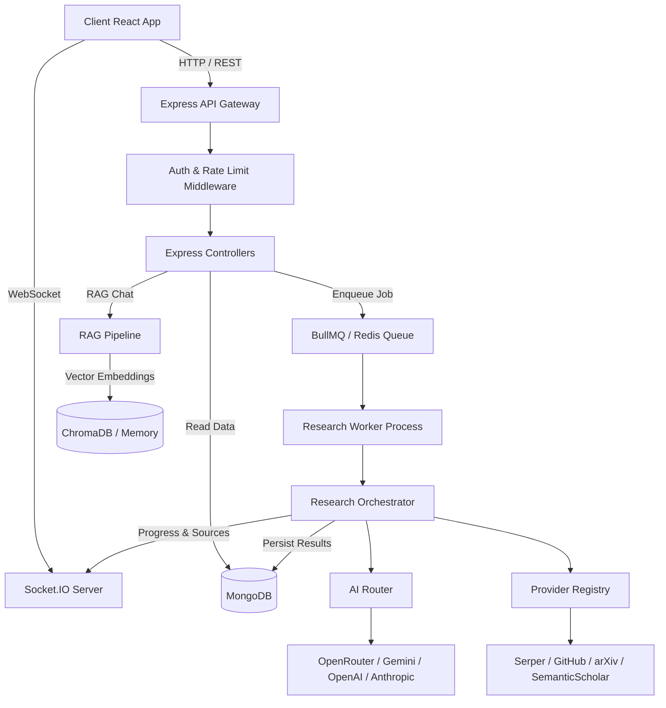

### Diagram 2: Request Lifecycle
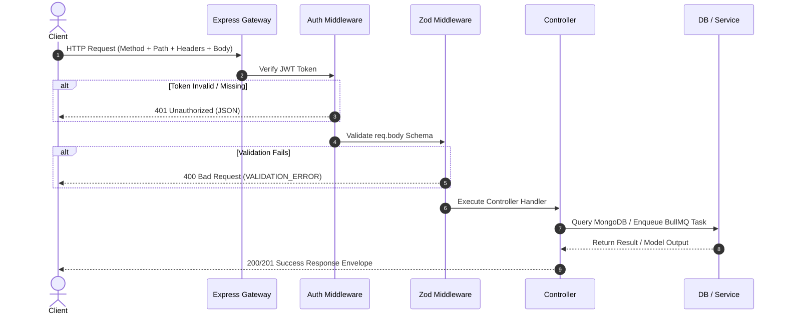

### Diagram 3: Authentication Flow
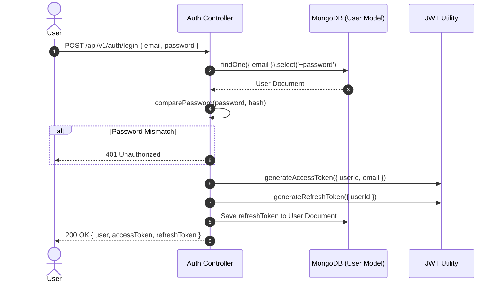

### Diagram 4: Research Pipeline
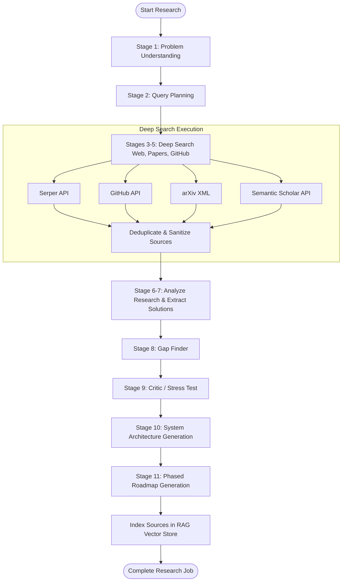

### Diagram 5: Queue & Worker Flow
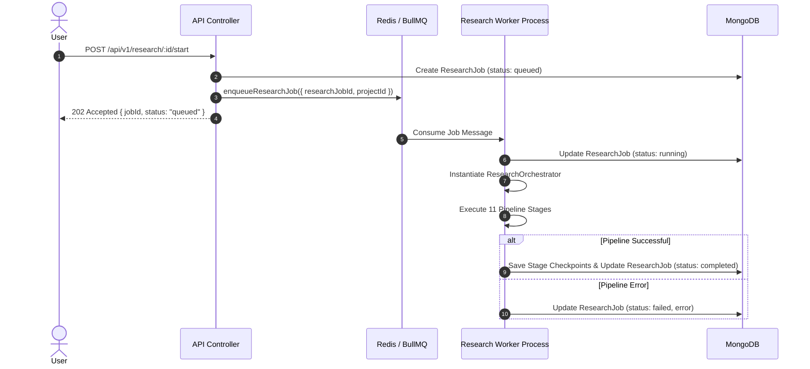

### Diagram 6: AI Router Flow
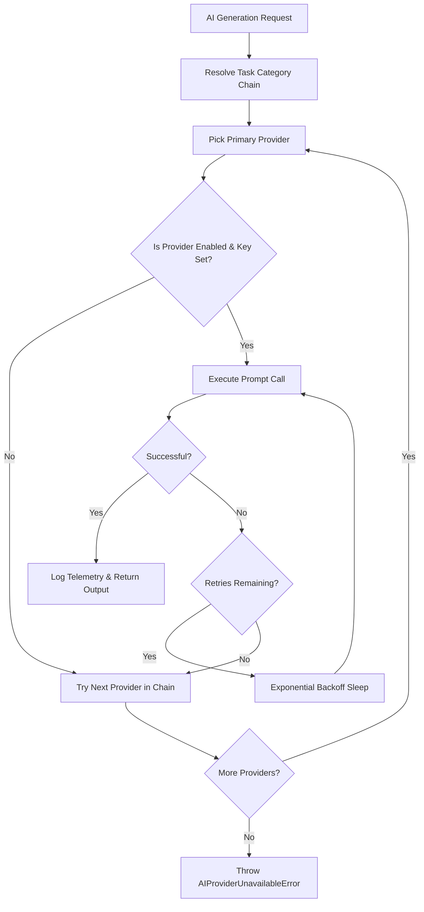

### Diagram 7: Provider Execution Flow
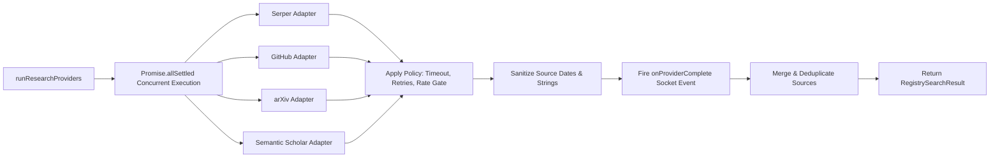

### Diagram 8: Database Relationships
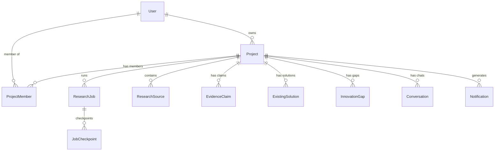

### Diagram 9: Socket.IO Communication
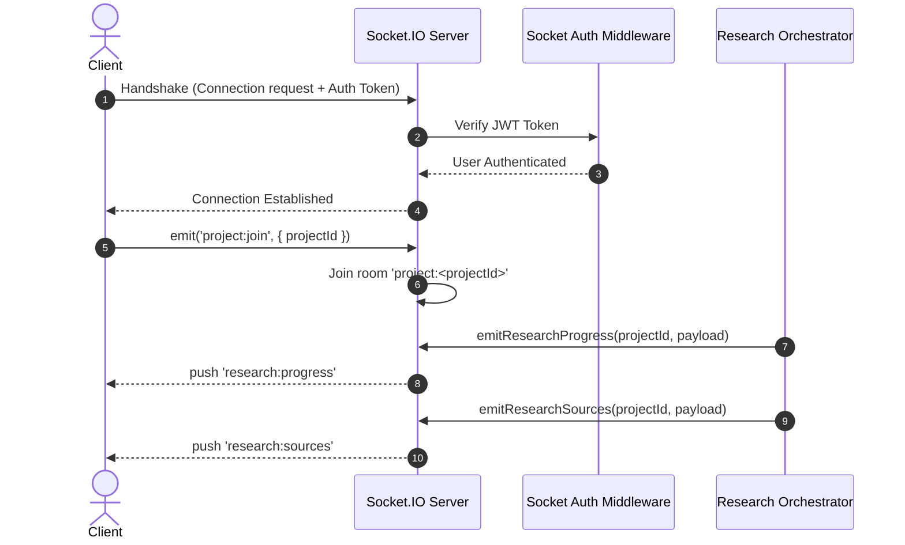

### Diagram 10: Export Pipeline
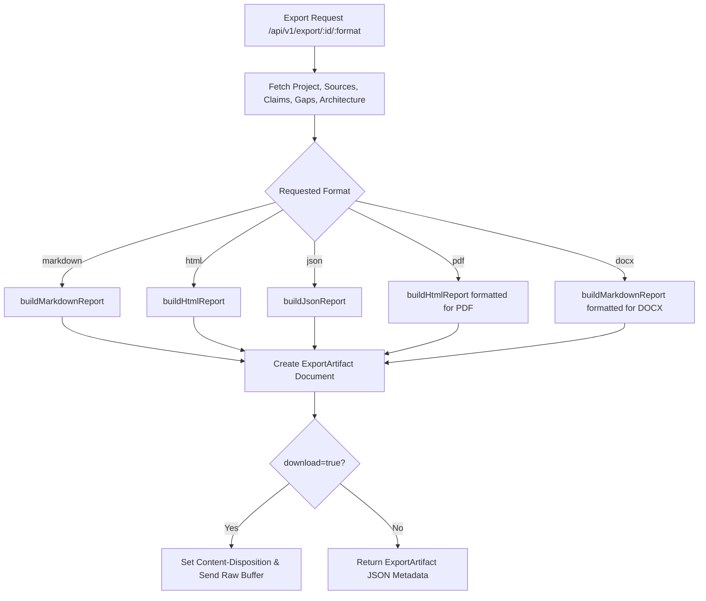

### Diagram 11: Error Handling Flow
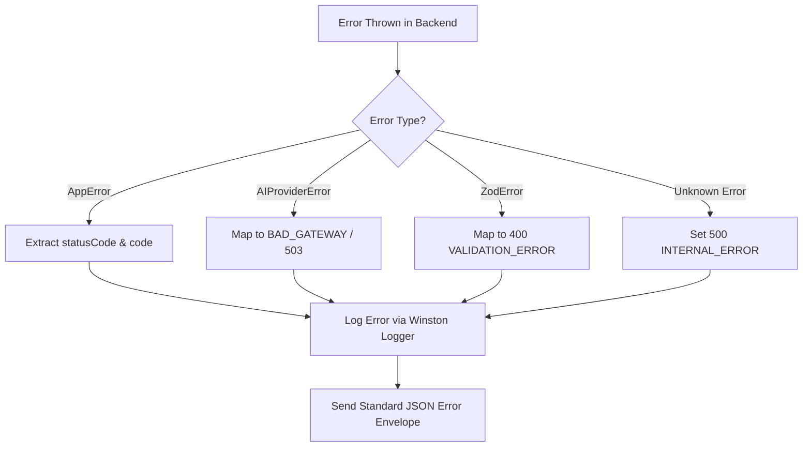

### Diagram 12: Deployment Architecture
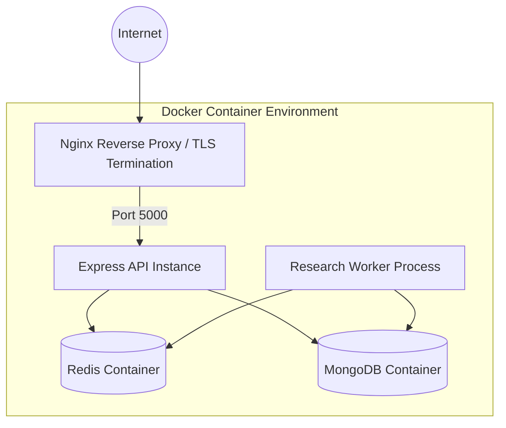

### Diagram 13: Infrastructure Architecture
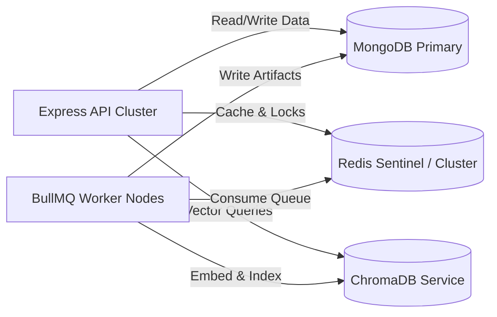

### Diagram 14: Module Dependency Graph
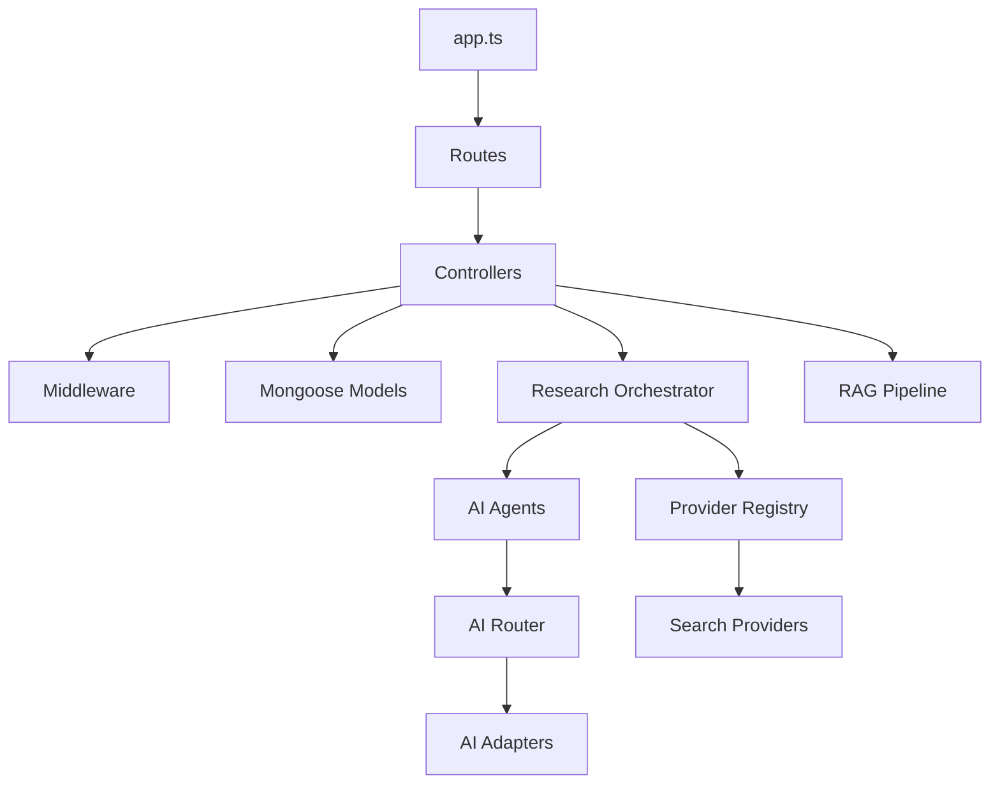

### Diagram 15: Service Interaction Diagram
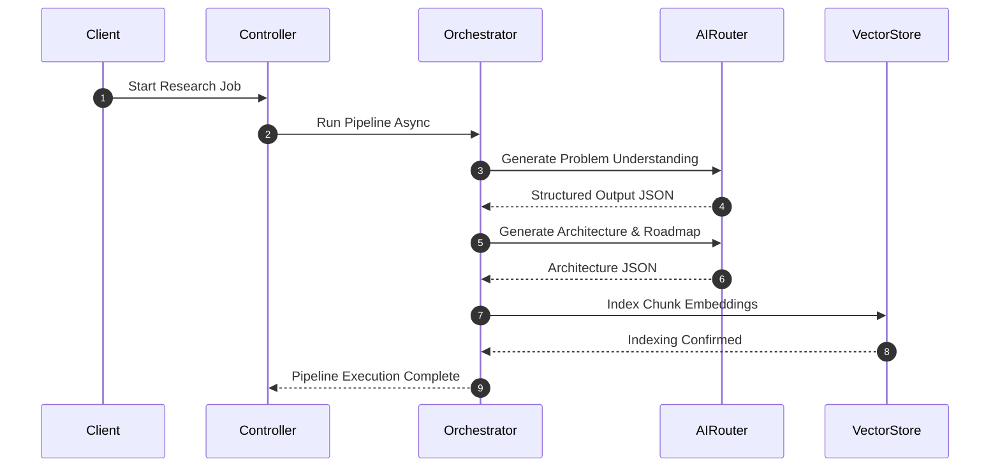

---

## 21. Code Quality Audit

1. **Unused / Obsolete Files:** None detected. All modules in `src/` are imported and referenced across controllers, orchestrators, workers, or tests.
2. **Duplicate Logic:** `calculateCost` and `estimateTokens` functions in `AIRouter.ts` duplicate basic token estimation heuristics; consider standardizing into a shared `token.utils.ts` in future refactors.
3. **Technical Debt:** In `chroma.client.ts`, `MemoryVectorStore` is used as an in-memory fallback when ChromaDB is unavailable. While resilient for development, in high-concurrency production deployments memory stores will not sync across multi-node API instances.
4. **Security Hardening:** Rate limiters (`authLimiter`, `researchMutationLimiter`) currently rely on memory-store IP tracking (`express-rate-limit`). Configuring a Redis store for `express-rate-limit` would ensure rate limits persist across load-balanced nodes.

---

## 22. Current Limitations

1. **PDF / DOCX Direct Rendering:** Currently, `ExportService.ts` returns styled HTML for `pdf` requests and Markdown for `docx` requests, relying on client-side or proxy conversion.
2. **Vector Store Clustering:** Vector indexing falls back to process-memory (`MemoryVectorStore`) if ChromaDB connection fails.
3. **Synchronous RAG Indexing:** RAG indexing is triggered post-research; very large source libraries (>500 documents) may increase background completion latency.

---

## 23. Future Extension Points

1. **Native PDF/DOCX Binary Exporters:** Integrate `pdfkit` / `puppeteer` and `docx` npm packages to generate binary file streams directly.
2. **Distributed Rate Limiting:** Swap `express-rate-limit` memory store with `rate-limit-redis`.
3. **Multi-Tenant Vector Collections:** Extend ChromaDB client to partition collections by tenant workspace ID.
